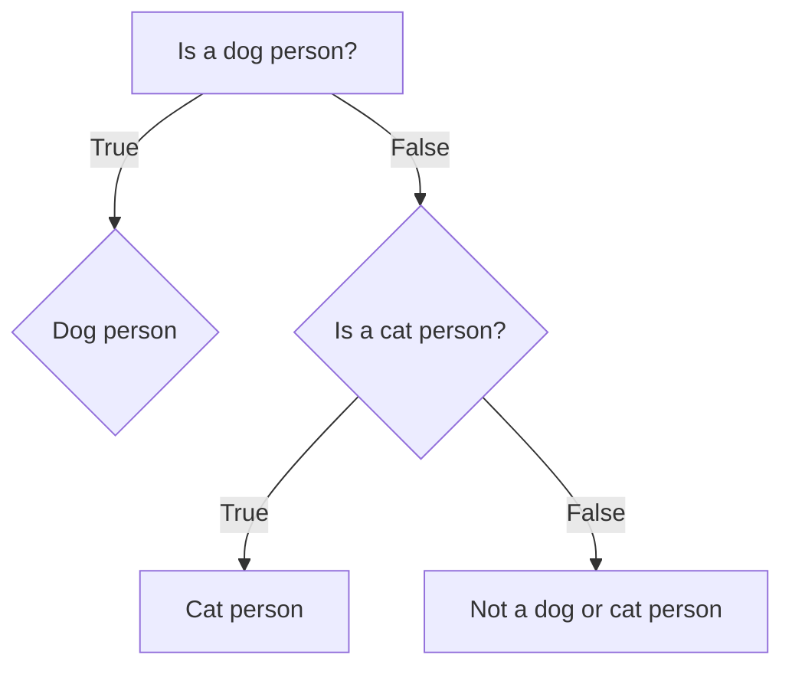

# Computer Says No: Removing Technological Barriers in Coding
Many students come to their first programming course or workshop with little or no experience in any programming language. As well as learning how to write code, students are also required to navigate file systems, open and use interfaces, and potentially work on the terminal. There is a wide range of computer literacy amongst students. Some will possess this tacit knowledge and be completely comfortable with these tasks, but others will have to catch up with these skills, making the initial sessions much harder. Helping these students keep up with the lesson is a challenging part of teaching introductory programming courses.

If students are working on their own computers, there will be a variety of different operating systems and software configurations. This can make the provision of universally helpful instructions difficult and, in some cases, it might be difficult or impossible to install the desired tools at all. Error messages can also be difficult to decipher, particularly for novices. This can lead to students, quite reasonably, having many questions for tutors. This slows down the course, reducing what can be covered, and frustrating students who are set up and ready to go.

In this chapter, we will explore some of the techniques and tools that we, as educators, have found to help solve or mitigate these problems. Examples and observations of student behaviour are derived from our experiences in the classroom, which cover a range of class sizes from 10 to over students, undergraduate foundation years to research postgraduates, across a variety of subjects from Biosciences to Physics to Computer Sciences. Specifically, we will discuss:

* The importance of clear wording, sections and images
* Using embedded gifs and screen recordings
* The usefulness of supplementary materials
* Using pre-recorded videos
* Embedded executable code blocks
* GitHub and other software development sites
* GitHub Codespaces (and other cloud-based dev environments)
* Docker-based platforms
* Installation support different OS/devices
* Office hours and drop-in sessions
* Teams channels (and other group chat services)
* AI-assistance

## Clear wording, sections and images

Programming for the first time can be a challenging experience for a student, as there is a lot to learn from the first class - from how to log in and set up to how to write, build, debug and execute programs. Hence, learning material will need to contain a lot of information for students to be able to follow instructions and write their first program. 

There is a lot of terminology in describing a programming language, which can confuse new students, such as variables, vectors, and functions. These are also quite abstract concepts, so finding a way to describe them in simple language can boost understanding. 

Sections can help students progress through the learning material and keep track of what they have and haven't done. Clear section headings and numbering can allow students to make a note of where they are, and also describe what task they are stuck on to the teaching staff. Additionally, splitting up a long worksheet into several smaller pages may reduce students' feelings of overwhelm by presenting a few manageable tasks at a time. 

Programming is quite text-heavy; most instructions are written in text, and code examples and output are also often text-based. Incorporating images into material can help to break this up for the students and make the material more visually stimulating. This should be done in an accessible manner, with alt-text provided where appropriate. These images could provide more explanation of a key concept (as in the image below). Alternatively, they could be images which explain the concept of the task; for example, if using a dataset which includes penguin flipper measurements, then providing an image of the represented penguin species.

Flow chart visually demonstrating the logic behind an if, elif and else statement in Python, generated using the open-source JavaScript-based tool [Mermaid](https://mermaid.js.org/).

## Embedded GIF screen recordings

Instructions are never clear enough. You can write detailed step-by-step instructions for how to get set up, and also start a class with a live demonstration of exactly which buttons to click. You may find, however, when you start to walk around the class, that many students in an introduction to programming session have yet to run their first line of code. They may have arrived late, or had technical issues with the first computer they logged into, or missed a step in the demonstration, or for any other reason not been able to follow the instructions.

One technique which can easily enhance setup instructions is a GIF screen recording. This can show each step really clearly and works especially well with the younger generation, who are more used to video tutorials than they are following written instructions. 

An example below shows key frames from a GIF recording of how to create a new folder and an R script, along with running a line of code, in RStudio. 

Keyframes of Example GIF of how to use RStudio

These can be embedded in any online-based tutorial, such as an HTML file or within a page written on a Virtual Learning Environment (VLE) such as Moodle, Blackboard or Canvas. For long processes, you can combine multiple GIFs with text instructions and clear headings (Step 1, Step 2...). 

To make them, there are many different screen-recording software programs you can use. One tool is [LICEcap](https://www.cockos.com/licecap/), which is available for both Windows and Mac, and is free and open source. It records directly to GIF format, so it can be used straight away. Alternatives include the Snipping tool in Windows 11, which can export any screen recording of less than 30 seconds length as a GIF, and [PyPeek](https://github.com/firatkiral/pypeek/) which works on Windows, Mac and Linux environments. [ScreenToGif](https://www.screentogif.com/) which works on Windows allows for both MP4 and GIF creation from the same clip or GIF creation from uploaded MP4s which could be useful for making short GIFs from longer videos or screen recordings. 

Using these GIFs, students can be directed to the worksheet and most will be able to follow the instructions and set themselves up - freeing up more time for practical questions on the programming language. The GIFs also become a resource they can return to, so instructions do not need to be repeated in every class. 

## Supplementary Materials

Some modules can require pre-existing skills in tools such as data visualisation and interpretation, and learning these skills may not be a learning outcome of the module. Instead, these skills may be assumed prior knowledge, which can cause problems for students who do not feel comfortable with these skills. For cohorts with diverse backgrounds, such as postgraduate students, extra care is needed to support novice learners. From that perspective, having clear and open communications with learners to understand their background is a good starting point. To support their learning process effectively, supplementary learning material such as a deck of slides, glossaries and cheat sheets can be provided. These can be referenced by novice learners and can help them keep up without slowing the progress of more experienced learners.

Proactively consulting with learners can be useful to decide which type of supplementary material would be most beneficial for the cohort. A module-specific glossary of key programming terms and common troubleshooting can be a useful reference. Supplementary materials can also include summaries of technical concepts and practical code implementations. More comprehensive materials can even include worked examples or mini exercises with different styles of questions such as code completion or code adaptation. Here I can add a snapshot from a glossary example of my Representing Data ?

Learners who lack some of the assumed skills may still have to work harder to complete a course, but structured and targeted supplementary materials can make it possible for these students to catch up and keep up.

One downside of the inclusion of supplementary materials is the tendency for scope creep of the course. It can be easy to take a 2 hour course and turn it into a 5 hour course with a much larger amount of content. Whilst this can provide necessary context for students with less background knowledge, it risks increasing the amount of content all students might engage with. Some students may even feel obliged to engage with the supplementary material even if it’s not necessary for them. For these reasons, if supplementary materials are used, they should be minimal in covering the assumed knowledge for the course and clearly structured so students can identify which parts are relevant to them personally. Additionally, the nature of the materials as an optional resource to offer a recap of assumed knowledge should be made clear.

## Pre-recorded videos

Pre-recorded videos can be useful, and can replace or supplement lecture-based teaching. This is known as a ‘flipped classroom’. These videos can be a good way to explain complex concepts to the whole cohort, allowing students to study at their own pace when it's convenient for them. A short multiple-choice quiz after a video can be added in most VLEs and can reinforce the content of the video and help students determine whether or not they understand the concepts covered. 

Students may use the videos in a variety of ways. Some students will watch the videos before the classes and come prepared with questions - these students tend to progress very quickly. Some students will instead watch the videos during the class as they try and complete the worksheet activities. This can also be effective, as they can pause and rewind when needed (which they can't do during a live lecture). This approach can also be problematic if they are playing the video audio out loud or if they spend the whole class copying from the video and don't progress to trying any practical programming themselves.

Tips for effective videos: 

1.  Short and concise: a series of 5-10 minute videos helps make it easier for students to maintain concentration, and can be interspersed with other activities such as readings or exercises. Shorter exercises are also easier and quicker to iterate if they need updating. If a longer video is used, clear time stamps allow students to go straight to the part they need explanation for when they hit an issue. 
2.  Live coding: Software such as OBS can be used to film both your camera and your screen so that you can demonstrate concepts by live coding. This is especially useful for demonstrating debugging - making a (purposeful) mistake in the code and then explaining the error messages and how to fix it. This could also be used to demonstrate how to search for answers on sites such as Stack Overflow, or ask an AI tool for suggestions (which may or may not be helpful!). 
3.  Accurate subtitles: Subtitle auto-generation is continually improving, but it can be worth going through and correcting any noticeable errors. This then allows students to follow the video with subtitles in class if they don't have headphones. 
Existing videos can be a good source of inspiration. There are many programming videos aimed at beginners on educational channels on YouTube. These are often high-quality videos with a high production value (polished, professional and well-made) which can be very engaging. However, not all videos need to have a production value to be useful. Videos with lower production value can be made very quickly to respond to issues raised by students during a module, or to clarify points that were unexpectedly difficult. 

## Embedded executable code blocks

It's also possible to provide worksheets which have embedded executed code blocks. These come with the benefits of fewer installation requirements and quicker times to set up and get started, but also have some drawbacks. They can work well in combination with other methods so that students can test short bits of code without setting up elsewhere. 

### Jupyter (and other) Notebooks

Jupyter Notebooks can be a useful tool for learning programming, and it is possible to write a worksheet where the instructions are in a markdown format code block, followed by editable code blocks with over 40 languages supported. 

One advantage of this is that everything is in line - printed outputs and graphs, for instance, can be viewed directly underneath the code block. And students can work directly on the worksheet. 

Although requiring a paid subscription (a lot pricier than most other options here), [CoCalc](https://cocalc.com/) is an interesting use of a Jupyter Notebook with collaborative editing. This can work quite well in a remote teaching environment. A teacher account can assign worksheets directly to student accounts, and also enter the student's folders and files. Similar to multiple people editing a Google Doc, a teacher can see student edits to their work in real-time and also add notes. This feature has also been added to [Noteable](https://noteable.edina.ac.uk), which is hosted by the EDINA at the University of Edinburgh and is available at a number of universities in the UK. 

One disadvantage of Jupyter notebooks is that executed code is saved into memory - even if that code is then deleted. This can lead to issues trying to debug an unusual error, where the problem code *has since been deleted*. One time, a student using a Jupyter Python notebook had named a variable `str`, overwriting the built-in `str()` function. Other notebooks than Jupyter can solve this (by updating the entire notebook state on changes), but Jupyter is by far the most available solution.

Screenshot of Jupyter notebook with Python-generated scattergraph

### WebR, Pyodide

WebR (for R programming) and Pyodide (for Python) allow for integration of interactive code blocks in HTML-based worksheets. If writing worksheets in markdown using [Quarto](https://quarto.org/), the quarto-live extension can be used to include these interactive code blocks. 

The advantage of these is that you can have a worksheet which prompts a student to test parts of code as they go. They can also be great for quick explanations in class, so students can test something without altering the code they are working on. 

Both of these work with a variety of common packages such as ggplot (R) and matplotlib (Python). The quarto-live extension can also be used to generate exercises where students need to fill in the blanks in the provided code, and this can include hints and answers. 

Screenshot of a Pyodide exercise

The disadvantage is that the code a student writes is not saved anywhere - so this has to be made clear to them. It is only for temporary use. Additionally, as with the Jupyter notebooks, all executed code is saved into a temporary memory so one code block may function differently depending on which blocks were run previously. 

## GitHub and other Software Development Sites

GitHub, and its competitors such as GitLab, Forgejo etc, are websites that allow users to store code for a project in an online repository using the Git version control system. GitHub, in particular, is currently popular and widely used in software development and data science, and provides many useful tools that we can use to make life easier for our students.

The first, simplest use of any of these sites is to store course materials in a repository. A wide variety of file types can be stored, allowing scripts (such as `.py`, `.ipynb`, `.C` and teaching materials (such as `.md`, `.pdf` or even PowerPoint files) to be stored together. Educators can define the content of the course and its organisation into directories. Students are able to download these materials directly to their computer, making it easier to ensure students have the correct files and directory structure on their computer. Indeed, as use of version control systems themselves is a useful coding-adjacent skill, interacting with the repository can provide additional learning benefits.

Furthermore, when adopting server or Docker-based solutions in educational contexts, the collection of all educational materials in a GitHub repository markedly simplifies the process of importing data. These platforms, including Google Colab and Posit, integrate easily with GitHub, allowing effortless uploads of comprehensive educational content directly into virtual learning environments. This setup, therefore, enhances accessibility and maintains a uniform teaching approach across various platforms. Unfortunately, the integration of some such platforms with GitHub alternatives is often less good - it’s often possible to get them to work with GitLab etc., but the flow is less polished.

The built-in GitHub integration streamlines the teaching workflow, enabling instructors to update teaching materials in real time. As these updates are pushed to GitHub, they can be synchronised automatically with the student's learning platforms, ensuring all participants have immediate access to the latest resources. This synchronisation eliminates the common logistical hurdles associated with outdated teaching materials or inconsistencies in software versions across different student setups.

## Cloud-Based Dev Environments

While students can see the code held on GitHub and its peers, they cannot run it in the online file viewers, which can be frustrating for a novice who just wants it to simply work. Running the code locally on their machines involves downloading it and configuring an appropriately set up environment, which can be a challenge for less confident students.

As an alternative to running code locally, “cloud-based dev environments” host an equivalent system on cloud-based services, often incorporating a browser-based IDE. This can help students to quickly get code running. One prominent example is the “Codespace” feature offered by GitHub (owned by Microsoft), which integrates Microsoft’s Visual Studio Code IDE. The majority of this section talks about Codespaces in particular, however, alternatives are available, such as gitpod (which integrates VSCodium) and Replit. These alternatives are particularly relevant if you are concerned about vendor lock-in in the Microsoft ecosystem.

A Codespace is a development environment hosted by GitHub. Each Codespace will be based on a repository. This allows learners to visit a GitHub repository owned by the teacher containing the course materials and start a Codespace. This Codespace will be owned by the student and persists for 30 days by default, allowing them to revisit the Codespace if the course spans multiple sessions, or to revisit it after the session. Learners are also able to download the materials from their Codespace, allowing them to keep any annotations they make during the course or their solutions to exercises.

By default, a Codespace will open a Visual Studio Code interface in the browser. This makes the interface very portable as it will work on any operating system and is independent of the learner's computer. This greatly reduces the likelihood of problems during setup and means the learner doesn't need to install anything locally on their computer before the session. Visual Studio Code is a powerful and flexible interface, supporting a wide range of programming languages and tools. This includes a built-in Linux terminal allowing command-line commands and other programs to be run in the Codespace.

The Codespace is run within a Docker container, which is defined by the creator of the repository. This allows the educator to define the environment the learner is using, including installing programs in the container, installing packages and dependencies within a programming language environment, or installing Visual Studio Code extensions. This setup will be done automatically when the Codespace begins. This means the educator can make sure all tools are correctly and reliably installed across all learners' environments. The learner will still have to learn to navigate the interface, but there should be many fewer problems relating to setup compared to students locally configuring their own system.

## Docker/Server-Based platforms

Within the sphere of computer programming education, Server-based platforms offer a promising avenue to dismantle the initial barriers that commonly discourage learners. Tools like Posit and Colab allow beginner-level students to interact with code environments with a couple of clicks. These platforms, by design, minimise the oft-dreaded setup processes that can appear overwhelming to novices and often constitute a significant road block into thier learning experience. Traditional local setup entry barriers in coding, often involving intricate installation and configuration steps, might deter beginners even before they engage with the actual coding exercises. Such steps can also lead to a proliferation of setup errors, turning what should be an exciting learning adventure into a tedious, error-prone process. This issue is particularly pronounced in online and hybrid learning environments. 

In fully in-person classes, instructors or teaching assistants can quickly diagnose and resolve installation problems simply by glancing at a student’s screen and offering immediate guidance. In contrast, troubleshooting in remote settings is far more complex. It often requires extended back-and-forth exchanges in the chat or moving the student into a breakout room, where they must share their screen. While screen sharing can be effective, it frequently causes students to miss important portions of the live session, creating additional learning gaps and disrupting the overall flow of instruction.

Server tools address these issues as they require no initial setup from the user's end. This absence of setup not only accelerates the starting process but also spares students from the demotivating sequence of 'boring' steps, allowing them to dive directly into the more gratifying aspects of programming. Moreover, some of these platforms provide free access to computing resources, which is a significant advantage, particularly for students who do not have the means to acquire powerful hardware capable of running complex code or large applications.

The benefits extend to accessibility and collaboration. Being cloud-based, these tools are accessible from anywhere, facilitating a flexible learning environment. Additionally, as mentioned above, these platforms are inherently collaboration-friendly and in many cases support version control by default.

Despite these substantial benefits, several challenges persist. Pre-loaded library conflicts can arise, posing a significant hurdle compared to the more controlled, albeit time-consuming, process of manually installing each necessary library. This automated convenience could sometimes backfire, leading to intricate conflicts that are hard to resolve without comprehensive control over the server environment. Furthermore, instances of server crashes can disrupt the learning process, culminating in potentially unsaved work and progress loss.

Visual Representation of Dependencies interrelation from [xkcd](https://xkcd.com/2347/).

Admin permissions, or the lack thereof, can also generate challenges, particularly when obscure errors emerge that require more than just user-level access to resolve. This limitation can frustrate users, especially when the path to a solution is barricaded by restricted permissions. Cloud-hosted development platforms can present additional challenges in remote and hybrid settings. Although the computational workload is handled on external servers, these platforms still rely heavily on the user’s local machine and network stability for smooth interaction. When used concurrently with video conferencing tools required for live instruction, overall system performance may decline. The combined demands of running a browser-based coding environment, maintaining a live video stream, and often sharing screens can result in slower execution times, lag, reduced responsiveness, or even session crashes. While this issue is particularly relevant from the instructor’s perspective, it can similarly affect students, disrupting the continuity of teaching and learning.Additionally, when server-based platforms are shared over a video conference tool (as in the case of remote and hybrid teaching), the overall performance can deteriorate, leading to more frequent server crashes and prolonged running times. 
Lastly, concerns around data security persist; while cloud environments offer numerous advantages, the necessity to run certain processes locally for security reasons becomes a complex task for those unfamiliar with how to configure local environments effectively.

These considerations draw a complex picture of the trade-offs involved in using serverDocker-based platforms for educational purposes. While they significantly lower the threshold for beginners to engage in coding by removing many logistical hurdles, they introduce a different set of challenges that need careful navigation to ensure a secure, effective, and continuous learning experience.

### Comparison of Main Server or Docker-based Options

Each Docker has its pros and cons and quirks. Below you can find a table that summarises them based on our experience.

|      Name      |      Type      |                                                          Pro                                                          |                                                                                     Con                                                                                     |
|:--------------:|:--------------:|:---------------------------------------------------------------------------------------------------------------------:|:---------------------------------------------------------------------------------------------------------------------------------------------------------------------------:|
| Posit          | IDE-based      | Comprehensive R and Python support; seamless GitHub integration                                                       | No pre-installed packages = long setup time  running (and possible crashes), data security concerns, can become expensive for larger teams or more extensive resource needs |
| PythonAnywhere | IDE-based      | Support for python, hosting a web app and using a bash console; can link teacher and student accounts                 | No graphics, data security concerns, IPython notebooks are paid-only, teacher and student accounts need to be on same server (EU and US versions)                           |
| Colab          | Notebook-based | Easily integrates with Google Drive and GitHub; free GPU access for better performance on larger datasets.            | Limited to Python for deep technical tasks, limited amount of pre-installed libraries, data security concerns                                                               |
| My Binder      | Notebook-based | Turns a Git repo into a collection of interactive notebooks, free to use                                              | Instances are temporary and can take ages to spin (traffic-dependent and therefore unpredictable), and are mostly Python-oriented                                           |
| Noteable       | Notebook-based | Designed specifically for educational purposes, integrates well with University/VLE login systems, good data security | pre-installed packages can create issues with additional packages needed, free only for a specific institution makes collaboration harder                                   |

## Installation support for different OS/devices

To effectively engage students from the beginning, having additional support for tools installation plays a crucial role. Particularly for courses with a lot of novice students, the tools that will be used in the course should be introduced to students early so they feel comfortable using them. As well as introducing tools in a workshop or lecture, asynchronous support resources such as webpages, slides and pdfscan help troubleshoot setup issues. These resources should be easy to follow and up to date. This may involve updating them during the first couple of weeks in response to student problems and feedback.

The first workshop of a course could be dedicated to installations, and making sure the student's computers are set up correctly and that they are comfortable with the tool. There may be device-specific issues, especially for devices other than Windows and Mac laptops such as Chromebooks, iPads and tablets. Additionally, students might miss the first week, or new problems may crop up as the course progresses, meaning ongoing support is vital. One-to-one support for individual students and Q&A hours can help make sure students remain supported in terms of their setup throughout the course. Sometimes, overcoming a technical obstacle can be too great a task to achieve in a session. In these cases, it is possible to suggest that students temporarily use alternative computational platforms (such as lab computers or online platforms) to avoid falling behind during the workshop, and the give extra help after the session to resolve their individual device-related issues.

## Office hours and Drop-in sessions

Learning programming for the first time requires a lot of time and practice. For students to be successful, they will most likely need to practice in their independent study time. However, this will mean that they do not have anyone to ask if they get an error message they don't understand or if they need any guidance on how to progress. If a student cannot progress and has to wait for potentially a week or longer before their next taught session, this can stall progress and demotivate the student. 

Office hours or drop-in sessions can be crucial in supporting students between sessions. This could be either individually or in small groups, especially for those who are otherwise struggling to keep on top of the course. Office hours could be scheduled for specific times throughout the week, and drop-in sessions could either be timetabled, arranged using a booking software such as Microsoft Bookings or arranged on request by email. 

Clear communication to students that this assistance is available and how to reach out if they feel like they need support is important for this to be effective. Doing this consistently from the first session, such as mentioning it once in every class, should help to reach students if they start to struggle at any point in the course. One-to-one or small group sessions can also be really useful for encouraging students and building their confidence, as well as finding out what areas of the course are most commonly misunderstood. 

While being available for student support outside of their timetabled teaching can be valuable, it is also important as educators to establish boundaries for our own well-being. For instance, only allowing student meetings to take place during your own working hours and blocking out time for breaks or to focus on other work. 

## Teams channels (and other group chat services)

Providing a managed online chat channel, or channels, can be effective to allow students a space to discuss the material. Choice of chat service can be strictly limited by University policy and GDPR: despite there being a wide range of alternatives -  from commercial, closed-source, hosted versions like Microsoft Teams, Discord, Slack, WhatsApp and so on, through more open-source, locally-hostable services like Mattermost, Zulip, RocketChat, etc. However, it is common to only be allowed to create official chat channels on one of these options, usually Microsoft Teams.

Setting up Teams channels for a course can be effective to allow a space for students to discuss the material, but this requires careful management. Specific channels can guide students to where they can find related materials or post their questions. To illustrate, an additional code support channel can be created, and students can be informed about how to share their code-related questions specifically. Often, the students who most want to discuss difficulties are also reluctant to admit to issues in a "public space" where teaching staff and other students can observe them. Pseudonymous or anonymous posting in Teams channels hosted by Universities tends to be against policy for safety reasons, but sometimes semi-anonymous posting (where only the teacher can see a poster’s identity) can help to relieve social anxiety of students. Tools such as Padlet may be more suited to allowing "low-pressure" anonymous discussion, but anonymous posting requires more moderation to ensure no inappropriate content appears. 

Teams, and other equivalent services, do provide useful integrations with many of the above services; however, and can be configured to at least coordinate updates to student material in a centralised way. 

## AI Assistance

Generative AI tools are rapidly becoming a popular tool for learning to program, or to support learning programming. This has some advantages and disadvantages when it comes to learning programming, but it also has some applications when trying to remove barriers to getting started. Generative AIs have been trained on a wide range of material, including sources like Stack Overflow, where programmers have been asking questions relating to errors and problems with setups for a long time. This means, in theory, generative AI tools should be able to answer at least some questions relating to setup issues.

There are also many ethical issues which may influence your desire to use Generative AI tools in the classroom. Generative AI companies consume large amounts of power in training (and build new, larger, datacentres at high rates, with their own environmental impacts).  Many Generative AI models were trained on copyrighted data without consent and  their unmanaged adoption poses significant workers’ rights issues. Numerous cases have been recorded of Generative AI agents presenting a negative influence on social relationships. Several papers have also demonstrated that the training sets for most Generative AI models used for text generation (“LLMs”) have significant Western-USA English-speaking cultural bias, resulting in their outputs being similarly biased; this results in a “flattening” effect in expression for people interacting with LLMs to “improve” their writing, or when soliciting advice. Given their prominence within discourse, and the fact that people are still using them regardless of the above, it is still relevant to discuss their application to beginning coders.

Sometimes, pasting an error message into a Generative AI tool does give useful information that can help to solve a problem. However, there are important limitations for learners. Firstly, Generative AI tools can only see the information they are presented with. A tool like ChatGPT can only see the information in its prompts. A tool like GitHub Copilot can be integrated into the development environment and can see, or be provided with, the file structure of the project. More recently, GitHub Copilot can be used in "Agent" mode to interrogate the setup of the system in terms of installing programs, packages or their configuration. This is sporadically successful and can sometimes identify and fix issues, but this is unreliable. Generative AIs cannot generally see the interface the user is looking at, making it difficult to provide information about certain classes of problems.

Another limitation to the information available to the tool comes from the learners themselves. A novice learner may not be able to adequately or accurately describe the problem they're encountering. This can lead to the tool misdiagnosing the problem. Learners with less experience may also struggle to implement reasonable attempts to fix a problem described by a generative AI and not know what follow-up questions to ask. Even if a problem is precisely described, generative AI tools can sometimes fail to suggest the actual fix to a problem. A tutor looking over a student's shoulder in a session may be able to immediately fix the same problem, particularly if they're an expert in the area or have observed an exercise being tackled by lots of students before.

Educators are often also skilled at quickly establishing a learner's level of understanding and providing further help and explanation when necessary. Generative AI tools are not yet good at this as they can often suggest code which uses advanced structures that the learner has not yet encountered, which could overwhelm and confuse the learner, rather than gradually introducing new concepts and structures as the learner progresses. 

At their current level of maturity, generative AI tools are unreliable, particularly when it comes to helping novices with limited tacit knowledge of the area being studied. Sometimes they are helpful, and attempting to use one is not a bad idea for a stuck learner, but it often won't work. As generative AI tools improve in their accuracy and become more closely integrated into development environments, their usefulness may improve.

However, a significant issue for generative AI tools is that they can become a tempting crutch. If a student is already underconfident in their skills, the apparent ability of a large language model to simply "solve the problem" can lead to disengagement from the material entirely - a student may substitute reliance on prompting the generative model for solutions for their own critical thought. In the worst cases, which some of us have observed, reliance on generative AI tools can result in the student effectively deskilling as a result. Generally, this pattern follows the form that a student initially develops some small skill in writing code from scratch, but increasingly leans on LLMs to handle "the difficult bits" - over time, increasing amounts of the coding process are handled by the LLM, to the extent that the student is no longer confident in even starting a project without the LLM to provide some initial material to work with.

## Conclusions

In this chapter, we have discussed a variety of barriers that students may face when trying to engage with learning activities relating to programming. These are varied, including technical, cultural and practical aspects. There are a number of steps that we, as educators, can take to mitigate these problems and we have outlined and discussed some of the approaches that we have found work for us. A common theme relates to reducing cognitive load - the more we can reduce the level of tacit knowledge, setup and background information, the easier it is to get beginners started. Careful consideration of the order in which skills are taught within a course and across courses can also be helpful for ensuring that students have the correct skills when their studies require it.

Every context is different in terms of the cohort of students, the material being taught and the time and resources available, so there is no “one size fits all" approach. A good technique is to be mindful of and actively identify the barriers students may face, putting yourself in their shoes. From there, it is possible to think of the most suitable mitigations and strategies we can use to reduce the barriers students face and improve their educational experience.

The above collection of advice, rather than aiming to be a definitive guide of dos and don’ts when it comes to removing technology barriers for novice learners, represents a set of wins and fails that the authors have experienced directly in the classroom. Removing technological barriers in programming education is inherently an ongoing process, requiring flexibility, clear communication, and a variety of accessible tools. No single approach will suit every learner, but by combining structured resources, visual guidance, and responsive support, educators can meet students where they are.

Crucially, these useful techniques are most effective when they are embedded not only within individual courses but also consistently across an entire curriculum. This consistency reduces cognitive load for learners and ensures that valuable skills—such as using GitHub, for example—are reinforced through repeated exposure, making them second nature. As digital platforms and AI assistance continue to evolve, maintaining a careful balance between support and the fostering of independent problem-solving becomes more important than ever. By addressing setup frustrations at both course and programme levels, and prioritising an inclusive environment, educators can lay the essential foundations for students to gain confidence and thrive as they begin their journey in coding.

::: {.content-visible when-format="html" unless-format="epub"}

## References {.unnumbered}

:::

