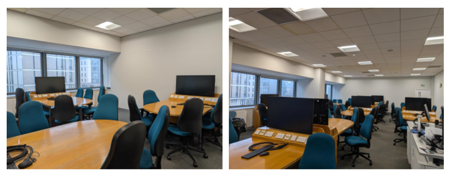

::: {.content-visible when-format="docx" note="this should be identical as authors above, for docx"}
author:
  - name: Umberto Noè
    orcid: 0000-0002-4962-5189
    email: Umberto.Noe@ed.ac.uk
    affiliations: School of Philosophy, Psychology and Language Sciences, University of Edinburgh
  - name: Franziska McManus
    orcid: 0009-0007-7218-8523
    email: z.mcmanus@ed.ac.uk
    affiliations: Edinburgh Medical School, University of Edinburgh
  - name: Eileen Y. Xu
    orcid: 0009-0003-5044-1437
    email: eileen.xu@ed.ac.uk
    affiliations: Division of Psychiatry, Institute for Neuroscience and Cardiovascular Research, University of Edinburgh
:::

## Introductions

**Umberto:** I am a lecturer in the Department of Psychology at the University of Edinburgh, where I have been teaching data analysis and programming skills for many years now. I am the course organiser of a large first-year course called [Data Analysis for Psychology in R1](https://www.drps.ed.ac.uk/25-26/dpt/cxpsyl08013.htm), or DAPR1 in short. This is typically taken by first-year Psychology undergraduate students, but the course also welcomes students from other disciplines.

**Franziska:** I am a Teaching Assistant for the MSc "Data Science for Health and Social Care" at the University of Edinburgh, where I teach R and Python via pair programming. As a tutor, I also teach R and statistics to second-year medics and first-year psychology students. This is my first year tutoring in the DAPR1 course.

**Eileen:** I am a PhD student based in the Division of Psychiatry at the University of Edinburgh. I have been a tutor since 2022, and have taught R and statistics on undergraduate and masters-level courses in Psychology. This is my third year as a tutor on DAPR1.

## Background

"Peer programming" is what I (Umberto) like to call the extension of pair programming principles [@TeachProgAcross_C36] to groups of more than 2 students. The name highlights how this approach blends the benefits of peer support and pair programming. After multiple years of hands-on teaching experience using this approach, I believe its pros outweigh the cons. This chapter presents five case studies to illustrate peer programming in action, why it was implemented, which challenges it addressed, and the successes encountered.

DAPR1 is a 20-week long in-person course (10 weeks per semester) and a typical week on the course involves:

* Two lectures of one hour each. The first focuses on statistical concepts/methods; the second on how to implement concepts/methods in R  
* A one-hour lab. This is a practical session, where students work to solve tasks with the support of tutors   
* Assigned reading to consolidate knowledge  
* A weekly quiz on the previous week’s material to ensure that students keep up with the course as its content is cumulative.

The 20 weeks are organised as four blocks of 5 weeks, where each teaching block focuses on a specific topic: exploratory data analysis, probability, inference, and common hypothesis tests. @fig-c16-structure shows a visual schematic of the course. The course materials can be found [on GitHub](https://github.com/uoepsy/dapr1) and the lab worksheets are visible [here](https://uoepsy.github.io/dapr1/2526/labs/).

{#fig-c16-structure fig-alt="The structure of the DAPR1 course. It is a year-long course, divided into two semesters of 10 weeks each. The 10 weeks of each semester are further split into blocks, each comprising five weeks of teaching. In the course labs the students produce reports, which they submit in the final week of the block. After each block they receive feedback on how to improve and solutions. The first three reports are formative, the last one is assessed."}

When in-person teaching resumed after COVID, student attendance at labs dropped substantially. After a couple of labs we regularly had more tutors than students. I wanted to find a solution to ensure students didn’t miss out on important contact time during which they could get support and guidance from staff. When the lab is over, the allocated hours of help are gone, and students have missed out on an important learning opportunity. Going to an empty lab is also demoralising for tutors who are there to help and end up waiting for an hour with no questions from students.

Based on student feedback and teaching experience gathered before I introduced peer programming, I noted three elements were key in driving engagement and attendance.

First, the transition from high school to university is a big change and for many students it can be isolating. Having a place to meet peers which also facilitates the start of new friendships is key to fostering a sense of community and belonging in a new environment. Students specifically left feedback that they didn’t feel part of a community and did not have a sense of belonging.

Second, students tend not to attend in-person labs if the worksheets include solutions. They just read through questions/solutions from the comfort of their home and post questions on the discussion forum. I tried withholding the solutions and only releasing them at the end of each week, but many students would choose to work at a one-week lag and on a given week they would work through the previous week’s worksheet which had visible solutions, rather than the current week’s worksheet.

Third, students left feedback that, as part of their courses/degree, they wanted more practice of writing lab reports to strengthen research skills such as planning, analysing, and disseminating findings. This was raised as part of the British Psychological Association re-accreditation meetings for our degree.

Taken together, the three elements above gave me a sense that it was key for students to work across multiple weeks to create an end-product, as a way to ensure that students engage through a sense of ownership of that product. Furthermore, working as part of a group introduces a sense of responsibility towards their group, so students show up to not let their team down. The steps I implemented, as discussed in this chapter, led to attendance at labs ranging roughly between 75% and 95% for four years in a row. Most importantly, they led to new friendships and support networks students could turn to for help.

## Case Study 1: From Pair to Peer Programming

Peer programming was my response to applying pair programming to a large cohort, and it means pair programming in larger groups. DAPR1 has varied in size over the years, but it’s roughly been between 210 and 320 students. When planning the number of labs to run each week and the number of student groups to form the following constraints had to be taken into consideration:

1. There is a limit on the number of tutors we can hire  
2. There is a limited number of “teaching studio” rooms, i.e. computer labs with a groupwork layout (see @fig-c16-room)  
3. The teaching studios are heavily booked   
4. The teaching studios typically have a small number of tables

The above constraints limit the number of labs we can schedule each week, as well as the number of groups we can form for pair programming within each lab. In the end, I settled for 4 labs each week, and I ask students to work in groups of at most 5 students, where one group occupies a table. I couldn’t feasibly ask students to work in pairs due to space constraints and having multiple pairs at the same table was distracting for the groups and not appropriate when the work produced is to be submitted as an assessment.

{#fig-c16-room fig-alt="Layout of a “teaching studio” room used for the DAPR1 course labs. There are multiple tables in the room, each with 5-6 chairs and a shared PC screen, which facilitates discussions and groupwork."}

When students attend their first lab session, they self-select a table as their group, and that will be their group for a semester. As with the standard pair programming model, one person in each group acts as the driver during a given session and the others act as navigators. Here, the driver is the student responsible for writing the code with the keyboard, while the navigators read the task, consult documentation pages, suggest the strategy to follow and fix any typos. Therefore, the driver has the support of multiple peers rather than just one navigator. Typically students self-organise such that one navigator has the tasks to complete open, another focuses on the R documentation/help pages and others suggest code and/or spot typos. The driver rotates after each session, ensuring that everyone in the group has contributed in a coding capacity (as driver) and in a strategic thinking capacity on how to solve a task (as navigators).

> **Franziska:** As a tutor, I check in with students to make sure that they are switching driver each session. To navigators, I offer guidance on how to use the course page and (sometimes) how to access the R help documentation. One aspect of pair programming which usually disappears is the idea that the driver should narrate their experience to give navigators an insight into their aims and thought process. I know this can feel uncomfortable to students, so I only step in when there is a group sitting in silence and the navigators are clearly lost \- as sometimes happens when the driver is more confident than other members of the group.

---

> **Eileen:** As a tutor, I try to be conscious of which students do/don't contribute, and whether they might be having difficulty keeping up. It can be difficult to ask for help on topics you're having trouble understanding, especially in a group setting. As a tutor, I try to alleviate this when I explain things to a group, and make sure that individual students aren't "singled out" for not understanding something. I often start by asking questions about the week’s concept/code; group members with clearer understanding are usually the ones to answer, and I can prompt them to lay out their thought process, filling in any gaps. This 1\) allows students with clearer understanding to consolidate their knowledge and build confidence by explaining concepts to their peers, 2\) gives students who are having difficulties the option to ask for help or pose follow-up questions without singling them out, and 3\) facilitates discussion in quieter groups, as students can direct questions and suggestions to a tutor (one person) instead of the whole group. Everyone gets to reap the benefits, and over the semester I get to watch students turn to me less and less as they become more confident in their ability to problem-solve as a group.

## Case Study 2: Peer Programming as Scenario-based Tutor Training

As course organiser, I’m also responsible for hiring and training tutors, an important step to ensure the course runs smoothly. Each year, I hire a team of six tutors (who staff four labs each week, with four tutors per lab, and also help with the marking of assignments). It is essential that tutors receive training, for quality assurance and to ensure they feel confident explaining the material and addressing any issues or computing errors during the labs.

I try to maintain a balance of new and experienced tutors each year, to ensure there is continuity of expertise but also the building of new expertise for the future running of the course. Experienced tutors also act as informal buddies to new tutors who can shadow them in the first few weeks of the course to see hands-on how tutoring works. 

Each week, I run a one-hour tutor preparation meeting where we all work through the lab worksheet that students will complete in that week’s labs. If students are expected to use peer programming in the labs, I believe that the best way to prepare tutors is to also run the preparation meetings as peer programming sessions. This leads to scenario-based training sessions that allow tutors to get hands-on experience with how peer programming works in practice, as well as the natural issues that appear when making typical typos/errors when typing the code for that week’s lab. This ensures the tutors have a preview of typical R errors they might have to help address in the labs.

Since the introduction of peer programming, the tutor preparation meetings have become an interesting discussion-based hour, where different perspectives are heard, new tutors strengthen their understanding, and it’s also a safe space to ask questions and seek clarifications as I act as navigator/driver when it’s my turn\! When I’m the driver I also tend to assume the persona of a novice programmer who needs more guidance.

> **Franziska:** The tutor sessions are enjoyable and create time for tutors to build community and share teaching experiences. They also provide direct access to the course organiser, who can answer questions about the course. 
>
> In the tutor sessions, we work through the lab worksheet exactly as the students will, which gives a clear sense of what we are teaching in the upcoming lab. If I had time for independent study, I would go beyond the lab content to focus on aspects I understood less well and the wider context of the course. Of course, a self-study approach is only better if someone actually does it. In a busy schedule, the tutor sessions create protected time to prepare each week. If a course organiser were concerned about their tutors preparing to a minimum standard each tutorial, these tutor sessions might be the better option.  
>   
> *Alternative approach:* In another course I teach on, tutors write a short reflection after each tutorial \- an alternative way to flag issues and for course organisers to keep track of how well the course is running. However, this can lead to course organisers fixing issues in retrospect, i.e. after the labs have run, while the tutor session approach is more pre-emptive, allowing for fixes before the labs start.
>
> When it comes to driving, we often take a mixed approach \- sometimes tutors pretend to be a novice student, other times we code using our own knowledge as tutors. This stems from the dual goals of the session: to get our coding up to speed and to expose us to questions students may have. At times, the friction created from struggling through each missing space, bad variable name and mistyped pipe can be frustrating (although I know that not all tutors share this view). One group member intentionally misunderstanding the other also hides one of the major positives of pair programming: working together as a team. For tutors who are experiencing pair programming for the first time, I feel it is important to model pair programming in its best light.
>
> The principal aim of the tutor sessions is to learn how to write the code we are about to teach. Although I am confident in my coding abilities, I often feel shy in the peer programming sessions, and am reluctant to volunteer as driver or to offer suggestions as navigator. This comes from a feeling that, as a tutor, I should be an expert on the content already \- it is what I was hired for, after all. There is also something about being in a group setting (course organiser included), which feels more vulnerable than it would with a partner.
>
> *Alternative approach:* I would be curious to try the tutor sessions without a course organiser at the helm (e.g. if they didn’t have time or wanted to let tutors work through the code themselves). We would lose the course organiser's insights of what students find difficult, but the experienced tutors would get a chance to fill the gap.

---

> **Eileen:** As an experienced tutor on the course, I use these preparation meetings to highlight common errors that students might make when completing the week’s lab exercises. The majority of DAPR1 students begin the course with no coding or R experience, whereas we DAPR1 tutors enter with more experience. This difference in experience is reflected in the errors we make in R and our subsequent approach to troubleshooting \- it can be easy to miss the kinds of mistakes that novice programmers make (e.g. missing parentheses, commas, quotation marks) and jump straight to scouring Stack Overflow. As medics like to put it, “When you hear hoofbeats, think horses, not zebras” \- especially during the first few weeks of DAPR1. 
>
> I find that modelling peer programming during these early preparation meetings is a useful way of practicing the kind of troubleshooting we will be doing. At the same time however, the dynamics within the tutor preparation meetings can be very different to the group dynamics seen during class \- though this is not unique to the peer programming approach. This can make it more challenging to implement peer programming methods in certain lab scenarios, such as in groups where there are significant language barriers.

## Case Study 3: Programming Towards an End-Product

To address the fact that lab worksheets with solutions could be completed from the comfort of home, the lab worksheets corresponding to the same block (each block comprises 5 weeks of teaching) are grouped in such a way that they together lead to the creation of a report. In other words, they are cumulative and each one builds on the context from the previous one.

The first three reports are formative, giving students the chance to obtain feedback when it matters most, i.e. while they are learning rather than at the end of the course. The fourth and last report is assessed. Students submit their work before they receive full solutions of each report and feedback on how to improve. Therefore, the lab worksheets only have tasks and hints available.

Working across multiple weeks motivates students to show up, as the different weeks are intertwined, and there is a shared understanding that people need to turn up and help to avoid the group falling behind, so students are keen to participate. This gives the group a sense of ownership and they tend to care about their work. Asking students to submit their end-product is also key to their engagement and attendance in labs.

## Case Study 4: Peer Programming to Foster Belonging

Year 1 of an undergraduate or postgraduate degree is typically a year where students need to form new connections. Peer programming (as well as the standard pair programming) has been a key element to ensure students form a peer-to-peer support network and form new friendships. The student feedback from the DAPR1 course with peer programming implemented speaks for itself:

> “I enjoy working in lab groups because I feel like it helps to have other people to learn and figure things out with.” - Student 1 
 
> “To be honest, I really like the group work of DAPR1. Before, I didn't participate in too many group activities, I prefer to study by myself. But the activities in the lab gave me a deeper understanding of group activities. Although I don’t want to admit that I actually have a lot of things I don’t understand about the study of DAPR1, the other members of the group helped me make up for it. Compared with self-study, group activities can gather everyone's wisdom, complete homework better, and become good friends with group members. For me, who came to study abroad alone, this is really lucky.” - Student 2 
 
> “The group work is very helpful. Not only have I made new friends, but I now also have people that I can rely on when I need help. Group work has also made the individual workload seem much lighter and we get things done faster.” - Student 3 
 
> “Yes I have found it extremely helpful. During week one, I felt extremely lost and confused but my group helped me with that and so I think having that was very beneficial. In addition to this, it helped as different people were better at different aspects than others and it also meant we could spot each other's mistakes quicker, before R tells you it will not work\! I also think that it is really beneficial because it gives you the perfect opportunity to work with other people and make potential new friends.” - Student 4

The above feedback, combined with the much improved attendance at labs, highlights the positive effect of peer programming on the student experience. Furthermore, many DAPR1 groups also become “study groups” for other courses and they end up meeting outside of class time.

> **Eileen:** This is a real highlight of DAPR1 for me, as when peer programming works, it can work extremely well. It’s a privilege to watch groups of students who start as strangers (who are all understandably disgruntled at having to learn statistics and R) become fast friends by the end of the year, and I think peer programming facilitates this. Making mistakes and asking for help is often scary, but the shared responsibility of peer programming means that errors are never one person’s fault \- and successes can also be shared as a group. Students who stay in the same groups get to make progress together, and since tutors cover the same groups week-to-week, I also get to celebrate how far they have collectively come since week 1\. 

---

> **Franziska:** From my experience of tutoring different cohorts, it seems to me that psychology first-years are particularly amenable to peer programming as a concept. For the most part, they enjoy spending time together (groups often chat while settling in) and navigate social settings with ease \- greeting tutors and fellow students alike. Students patiently guide each other through difficulties, so even when the driver is lost, they have supportive navigators to show the way. 
>
> Other cohorts may not share the same values. For example, in a course with a high workload, students may need to be highly strategic in their learning to keep up with the demands of the course. If pair (or peer) programming is seen to slow them down, it may be met with resistance. I have seen first-hand how this pressure influences how pair programming as a concept is received. Similarly, if students are interested in "getting the right answer" and don't expect to use programming again, they are less likely to see the value in exploring alternative approaches with other students. In contrast, the psychology students of DAPR1 have surprised me in how often they come willing to learn, even when other assessments loom. I think a large part of this is the welcoming atmosphere in labs and the reduced need for independent study outside of scheduled hours \- if you attend lectures and labs, you will learn statistical theory, see it performed in R, and apply it yourself in an assessed (or formative) report. For our first-year psychologists, there is also value in learning things well. They have two years of R courses to go, and a dissertation year after that. It is worth applying good practices and investing for the future.

## Case Study 5: Peer Assessment to Encourage Active Contribution and Sense of Ownership

As educators, we may be concerned (and many students are) with the fact that any type of groupwork could have free riders, i.e. people who benefit from the work of others without meaningfully contributing to it. To help address this challenge I wanted to have in place a strategy to reward students who contributed to the end-product, where the “contribution amount” is based on ratings by their peers. With the help of the University’s learning technology team, I based the implementation on the [WebPA tool by Loughborough University](https://webpaproject.lboro.ac.uk).

The assessed report created by each group receives a grade from the marker. 80% of the grade is fixed, while 20% of it is variable. Let me give an example: if a marker assigns a grade of 65 to the group report, 52 is the minimum grade that any group member can receive, and 13 points are distributed based on how much each person contributed as rated by their peers, using a Likert scale where 0 \= None, 1 \= Very poor, 2 \= Minimal, 3 \= Average, 4 \= Good, 5 \= Excellent. The rating is done within WebPA, where students use a form to anonymously rate their group members according to the following criteria:

* Overall, rate the positive impact of each group member's contributions to the project  
* Rate the extent to which each group member actively participated in group discussions/meetings  
* Rate the extent to which each group member contributed to the analysis strategy  
* Rate the extent to which each group member contributed to the code  
* Rate the extent to which each group member contributed to the writing of the report

I ask students to self-enrol in groups on Blackboard Learn, the virtual learning platform used by our university. WebPA easily integrates with many virtual learning environment platforms, making it easy to perform the peer assessment of contribution for the same groups created in the virtual learning environment.

The fact that students know that their grades can go up or down based on their contribution has been a key motivator for students to show up and engage with the projects. We did notice more discussions during the assessed report, in comparison to the formative reports which are not peer-adjusted.

The 80-20 percentages were chosen keeping in mind that the tool is not foolproof. First, it can be played if everyone in the group agrees to rate someone in a specific direction. Second, it can happen that a submission which received a passing grade can become a fail after the peer adjustment. The 20% adjustment limits the occurrence of this issue, and a higher level can lead to more of such cases, which are often questioned during scrutiny or moderation.

## Discussion

Peer programming has been a welcome addition to the DAPR1 course and, I believe, to the Psychology degree. Students have consistently given good ratings and feedback to the course, and the teaching is very interactive. It has been a pleasure to always enter into a lab room where there are active and lively discussions, and ideas bounce back and forth between students and tutors. Most importantly, students end up forming strong connections and leave the course having established a peer-support network they can turn to for help.

::: {.content-visible when-format="html" unless-format="epub"}

## References {.unnumbered}

:::
