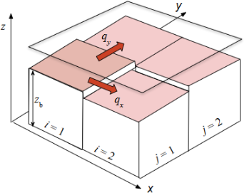
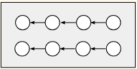

## Introduction

It is high time that students from civil engineering (CivEng) specialisation to get on with serious programming. Civil engineering, as underlined by [@wood2012civil], involves creating solutions to real-world problem. As such, each solution tends to be unique, which associates with particular environmental and societal circumstances pertaining to the local community. It is no surprise that computing had early been adopted in CivEng, and programming classes are added to their curriculum, as reported in a survey in the United States [@hoffbeck2016teaching]. After all, CivEng students cannot just sit there and look at their friends in the university doing all kinds of interesting stuff with code or AI/ML. But what are the difficulties behind the scenes?

And why do I focus here on such a narrow engineering discipline? Civil engineers have good logical ability, especially deduction, transforming and applying math equations, dealing with real dimension, approximation and optimisation. They have firm belief on deterministic: an expected system for this input must yield that output.

Until they start to realise that the computer system (or the compiler, anyway the students don't care about this) tends to play tricks on them. For example, a code snippet copied from the online tutorial doesn't work or merging two innocent-looking code chunks throws an error. That's when they realise that they will need a good approach to programming. The class instructor, too, will need to dedicate time to create good code examples as teaching materials. Perhaps examples that illustrate some key principles in programming but merge seamlessly with domain knowledge.

This chapter presents some of my experience in tutoring two classes, one for final-year undergraduates and one for MSc class, with the use of Python and Julia programming languages. In both classes, instead of delving into merits of the two languages nor making any comparison between them, I focused on the practical aspect of solving a typical civil engineering problem — sediment transport. For this problem, we are interested in the amount of sand moving in natural waterbodies (e.g. lakes, rivers) and how the bed elevation of such lakes/rivers changes in time, which has vast applications in real development projects. There are some maths and physics involved, but I will provide some simple explanations. Hopefully, by the end of the chapter we can pinpoint some "good practices" to engineering students who start to write their own code. The chapter may also benefit CivEng class instructors who are aiming toward more effective lectures.

## Code Implementation

### Logic of calculation

CivEng students generally do not encounter any difficulty in implementing a series of formulae in order, as well as translating a formula to code. For example, in the Python snippet below, the drag coefficient is readily calculated according to the math equation

**Math**
$$ C_D = \left[ \frac{0.4}{1 + \ln(z_0 / h)} \right]^2\ $$

**Code**

```{{python}}
CD = (0.4/(math.log(h/zo)-1))**2
```

CivEng students are well aware of complex engineering formulas and would be willing to write lengthy statements for mathematical expressions. Furthermore, they have adopted the style of naming variables according to the symbolic representation which is widely agreed in the literature.

Even a branching construction would not cause much difficulty, for example to calculate the critical flow velocity using Python. The CivEng student surely would not get confused with units during computation, as they can handily type in conversion factors along with the code:

**Math**
$$ U_{cr} =\left\lbrace  \begin{array}{ll} {0.19} D_{50}^{0.1} \log(4h/D_{90}) & \text{for }  D_{50} < {0.5} \text{  mm}; \\ {8.5} D_{50}^{0.6} \log(4h/D_{90}) & \text{for } {0.5} \text{ mm}  < D_{50} < 2 \text{ mm}; \end{array} \right. $$ 
**Code**

```{{python}}
if 0.1E-3 <= d50 <= 0.5E-3: # mm    
  Ucr = 0.19*(d50**0.1)*math.log10(4*h/d90)
elif 0.5E-3 < d50 <= 2E-3: # mm
  Ucr = 8.5*(d50**0.6)*math.log10(4*h/d90)
else:
  print('Warning: d50 out of range to apply formula for Ucr.')
```

### Dimension and units in civil engineering

A particular strength of the CivEng student is having keen eyes on physical quantities. The branching statement presented above shows that the student was aware of units and applied corresponding coefficients. The ability to tell the meaning from numbers allows them to check intermediate results and correct potential errors during computation. Another advantage is that by adhering to the rules of dimensions in physics, the students naturally familiarise themselves with the type system and therefore will not have much difficulty with languages like C#, Java, Scala, or to go forward and write type annotations in their Python code.

### Matrix manipulation

In many circumstances, the CivEng student has to deal with matrices, such as when solving partial differential equations (PDEs). One of such typical equations is the mass balance, where the (time-) change in "stock" is related to the spatial changes (gradients) of "flows". It is not too difficult for the CivEng student to understand the finite difference technique and implement a naive version to solve PDEs. As an example, in the problem of sediment transport in rivers or seas, we consider solving the equation for *z*<sub>b</sub> (the underwater bed elevation), which changes in time, given the two fluxes of sediment, represented as two components (*q*<sub>*x*</sub> and *q*<sub>*y*</sub>) in the two horizontal directions, *x* and *y*. It is helpful to visualise the river bed or seabed as a "tiled" surface where each cell has its own elevation *z*<sub>b</sub>. See the diagram (Figure 1) for a simplified representation of the quantities involved.



It should be noted here, that the CivEng student is equipped with numerical analysis skills, that can approximate the differential in terms of finite difference.

**Differential equation**

$$\frac{\partial z_b}{\partial t} = -(1-n) \left( \frac{\partial q_x}{\partial x} + \frac{\partial q_y}{\partial y}  \right)$$ <br /> where *z*<sub>b</sub>, *q*<sub>*x*</sub>, and *q*<sub>*y*</sub> are functions of *x* and *y*. Therefore, we will also make d_z\_<sub>b</sub>/d_t\_ a function of *x* and *y*.

**Numerical approximation**

$$ \left( \frac{\partial q_x}{\partial x} \right) = \frac{q_{i,j} - q_{i-1,j}}{dx} $$

Here the numerical approximation for one flux gradient term is illustrated.

```{{python}}
if 0.1E-3 <= d50 <= 0.5E-3: # mm
  Ucr = 0.19*(d50**0.1)*math.log10(4*hd90)
elif 0.5E-3 < d50 <= 2E-3: # mm
  Ucr = 8.5*(d50**0.6)*math.log10(4*hd90)
else: 
  print('Warning: d50 out of range to apply formula for Ucr.')
```

The naive approach is to use a nested list to emulate a 2-D array, which doesn't seem much performant. But that's enough for the CivEng who wants to get the job done. This way, the code is more transparent when using an index system with (*i*±1). Notably, there is similarity in operators and operands between Python and Julia (thus I will leave the ellipses in the Julia part). The differences are in for-loop syntax and the 1-based indexing system in Julia as opposed to Python's 0-based. A notebook implementation can be found at <https://nbviewer.org/url/coastal-study.uk/sed.trans/SedTrans.ipynb>.

**Code Snippet 1 - For Loop in Python**
```{{python}}
for i in range(1,nx):
  for j in range(1,ny):
    dqxdx[i][j] = (qx[i][j]-qx[i-1][j])/dx
    dqydy[i][j] = (qy[i][j]-qy[i][j-1])/dy
    dzbdt[i][j] = -(1-n) * (dqxdx[i][j] + dqydy[i][j])
```

**Code Snippet 2 - For Loop in Julia**
```{{julia}}
for i = 1:nx
  for j = 1:ny
    dqxdx[i,j] = ...
    dqydy[i,j] = ...
    dzbdt[i,j] = ...
  end
end
```

The use of matrix operations has an advantage in performance compared to the "naive" version above, usually quoted as 10 times [@langtangen2006python]. On the downside, the matrix notation obscures the indices `i` and `j` commonly found in numerical methods (see Figure 2, where part of a stencil[^c32_civil-engineering-1] is shown. In this part, where arrows represent subtraction, we are finding "local" difference in the same `qx` array).When using matrix manipulation, the bounds must be specified correctly in all matrix subscripts (see Figure 3 and the code below). So, there should be a consideration in choosing either approach.

[^c32_civil-engineering-1]: A stencil is a diagram showing a group of computational nodes where numerical approximation takes place.

**Looping through index**



```{{python}}
dqxdx[i][j] = (qx[i][j]-qx[i-1][j])/dx
```
```{{julia}}
dqxdx[i,j] = (qx[i,j]-qx[i-1,j])/dx
```

**Matrix-based computation**


```{{python}}
dqxdx[0:-1,:] = ((qx[1:,:] - qx[0:-1,:])/dx
```
```{{julia}}
dqxdx[1:nx-1,:] = (qx[2:nx,:]-qx[1:nx-1,:])/dx
```


Another source of confusion is due to the concept of "views" in NumPy, for which the submatrix, e.g. `dqxdx[0:-1,:]` in Code Snippet 4, is a copy of the array `dqxdx`. In essence, NumPy "views" will behave in unexpected ways. Surely, this can be explained to the students, but every such issue can add up and discourage the learners. Therefore, an "agreement" might be made beforehand, that the matrix `qx` here is calculated once and cannot be modified thereafter. Or else, you must switch to another programming language, e.g. MATLAB, although this comes with its own issues.

## Code reuse

To CivEng students, reusing code is actually more difficult than writing new code! While the students can implement the code quite well in terms of logic and calculation (see the previous section), they somehow feel embarrassed when having to perform the calculation again with a slightly different input data, or in the CivEng's language, another "scenario". Given the intuitive layout of code blocks in a notebook, the students tend to just copy-and-paste code and make minor edits, which leads to code with excessive repetition. Other gotchas can be found in Chapter 29 of this book [@TeachProgAcross_C29].

During my tutorials in the past, students were exposed to a limited amount of prewritten code in the form of Jupyter notebooks only. By reading these Jupyter notebooks, the students were able to pick out relevant code cells and run them. They would know which chunks of code should be executed and in what order, so that no errors emerges showing undefined variables. But when students copy chunks of code from the sample file to their *own* notebook, renaming variables is often required.

Another issue is lexical scoping. Being more acquainted to "physical" objects rather than information "pieces", CivEng students would insist on using different names for variables appearing in both the inner and outer scopes despite that these names would not conflict. This is reasonable for array data types, as in the case below, where the CivEng student creates a `zb_init` variable to store the initial state of the system (and the use of `copy()` to avoid the potential issues with using matrix views mentioned above). However, the situation is different for single numbers (scalars). Consider a variable for the characteristic "near-bed" flow velocity, `Uf`, which is created outside and being updated inside the function body, without affecting its original value.

**Code Snippet 3 - Lexical scoping-aware example**
```{{python}}
zb = np.zeros((nx,ny))
zb_init = np.copy(zb)  # initial value
dt = 2.0  # const param
S = 1E-4  # const param
zs = 1.0  # const state variable
Uf = np.sqrt(9.81 * zs * S)


def evolve():
  for i in range(1,nx): 
    for j in range(1,ny):
      zb[i][j] += dzbdt[i][j] * dt
  
  Uf = np.sqrt(9.81 * (zs - zb.mean()) * S)


for _ in range(nt):
  evolve()


print('Initial zb:', zb_init)
print('Initial Uf:', Uf)
```

## Code development

### Mental orientation

An important aspect of moving from a CivEng to a programmer is to re-imagining the conceptual model for the system. Compare:

| | CivEng | CompSci |
|--|----|----|
|**Paradigms:**|imperative, procedural|object-oriented|
|**Object type:**|concrete, physically meaningful|abstract, blueprint to generate instances|
|**Action:**|math and logic operations applied to parameters of the object|objects' methods invoked on instances|

Admittedly, it is not easy to persuade the student to adopt an OOP (Object Oriented Programming) style programming to benefit future use. While for certain disciplines, e.g. chemistry, the notion of class is inherent (class of elements), the CivEng is more inclined to think about real-world entities: a particular building, canal, etc. to be modelled.

Unfortunately, the common situation for CivEng is that many handbooks and guidelines adopt the procedural approach which can be summarised as follows:

1.  Check the set of input against some predefined criteria.
2.  Follow an established method, step-by-step (such as the one in the SedTrans notebook mentioned earlier), to arrive at some output (such as the vertical change in seabed level, `dzbdt`).
3.  Evaluate the result, `dzbdt` – is it in a reasonable range? Is it realistic, and how does it compare to similar studies in the past ("literature")? Furthermore, is the computational routine *stable*, i.e. the numerical error does not grow up unbounded, through many iterations.
4.  Apparently, most of the computational workload here lends itself to imperative programming. We could think of OOP aspects in organising a class of problems presented in step (1), or a class of test cases in step (3), but that is all. CivEng still relies on researchers in physics whose perspectives clearly align to the model: data in → transformation → data out.

## Generalisation

CivEng students understand the use of functions and are adept in translating formulation of various calculation routines into functions. So that should be enough for generalising code, shouldn't it? During a practice session, after having the students to estimate the derivative *f* '(*x*0) for the specific functions *f*(*x*) = *x*<sup>2</sup> and *f*(*x*) = cos *x*, I required them to generalise their `deriv_*` function to accept any math function. Well, how can we do that? – they doubted, until I showed that we can just incorporate the function under investigation into the function `deriv` (see the Julia code below). A first step toward functional programming.

**Code Snippet 4 - Student's version**
```{{julia}}
deriv_sq = function(o, h)
  ((o + h)^2 - (o - h)^2) / 2h
end

deriv_cos = function(o, h)
  (cos(o + h) - cos(o - h)) / 2h
end

deriv_sq(0, 1E-3)
deriv_cos(0, 1E-3)
```

**Code Snippet 5 - Recommended version**
```{{julia}}
# A generic central-difference approximation
deriv = function(f, o, h)
  (f(o + h) - f(o - h)) / 2h
end

deriv(x -> x^2, 0, 1E-3)
deriv(x -> cos(x), 0, 1E-3
```

## Tooling

The students are happy with Jupyter notebooks during class. Syntax highlighting, code auto-completion, and embedded plot outputs are features that are highly appreciated. Nevertheless, a dedicated environment like VS Code is needed for students who want to develop larger programs with debugging and version control (e.g. Git). In Chapter 29 of this book, El Gemayel et al. mention the use of Python debugger (`pdb`) in Jupyter Notebook environment, yet the more recent Jupyter Lab features a more convenient visual debugger so that students can track the changes of variables during the flow of the program.

There is a tendency of using AI in coding. While AI tools are a great boon for syntax checks and documentation, it would be unbeneficial to have AI chatbots generate the code skeleton and logic, as this part requires the ingenuity of civil engineers who possess the domain knowledge.

# Good practices

The list is non-exhaustive yet would be useful for CivEng students who start to develop their code:

-   Variable names should follow the widely adopted notations in civil engineering. When possible, use the Unicode characters for Greek letters, e.g., using α instead of `alpha` (subject to the language’s feature – this is favourable for Julia with keyboard shortcuts for such characters/symbols).
-   Extensive and meaningful documentation is needed since there are many empirical formulae used in CivEng and the choice of a formula should be justified based on the context.\
-   Whenever the names are cluttered, consider using namespaces; (Knowledge of the engineering specialisation is required.)
-   If facilitated by the language (in the case of Julia), prefer using loops with index variables (`[i±1]`) rather than implicit array position index (`[:]`).
-   Generalise code with functions, so that you can reuse it later. This is particularly useful in CivEng, which heavily relies on various recipes. Each recipe can be implemented as a function.
-   Using advanced features in Jupyter Lab or an IDE to organise and debug code (first step), and then aim toward collaboration, version control and testing.

# Final thoughts

In summary, although there is not much material available for CivEng students for code development, there are patterns they may adopt to boost their performance at work. In this chapter, I present some such common patterns. Due to the variety nature of the disciplines that a CivEng may involve, it is by no means to present a single context that they can build programs upon. Rather, I present a case of water/hydraulic engineering and sediment transport, showcasing field variables, spatial derivatives and implementing a finite difference numerical solution.

Given the ubiquity of materials and tools to learn and practice programming nowadays, CivEng students can leverage their skills to solve specific problems in their field. However, unlike data science where standardised software libraries have been developed, CivEng students may often find themselves coding from the ground up. In such situations, being able to design their program is crucial; and this can be accomplished through extensive practice with good programming patterns and continually learning to shift the mindset from “computing with numbers” to dealing with data organised on your computer. This is not easy, though, and I would refer to Mindstorms [@papert2020mindstorms], where the author used Turtle’s geometry to dispel the “mathophobia” among schoolchildren.

These days when programming is mandatory for CivEng students’ skill set, it is best for them to appreciate the programming activity as a way to represent their own workflow and reach a solution to their engineering problem, which can then be evaluated and improved later.

::: {.content-visible when-format="html" unless-format="epub"}
## References {.unnumbered}
:::
