## Chapter --- Hype and The Need for Responsible Compute

### Figure 0.0

**Licence**: CC BY-NC-SA

**Author/creator**: United Nations

**Source**: <https://sdgs.un.org/goals/goal3>

**Notes**: <https://www.un.org/sustainabledevelopment/wp-content/uploads/2019/01/SDG_Guidelines_AUG_2019_Final.pdf>

{#C08_E-WEB-Goal-03-ref width="20%" fig-align="left"}

### Figure 0.0

**Licence**: CC BY-NC-SA

**Author/creator**: United Nations

**Source**: <https://sdgs.un.org/goals/goal4>

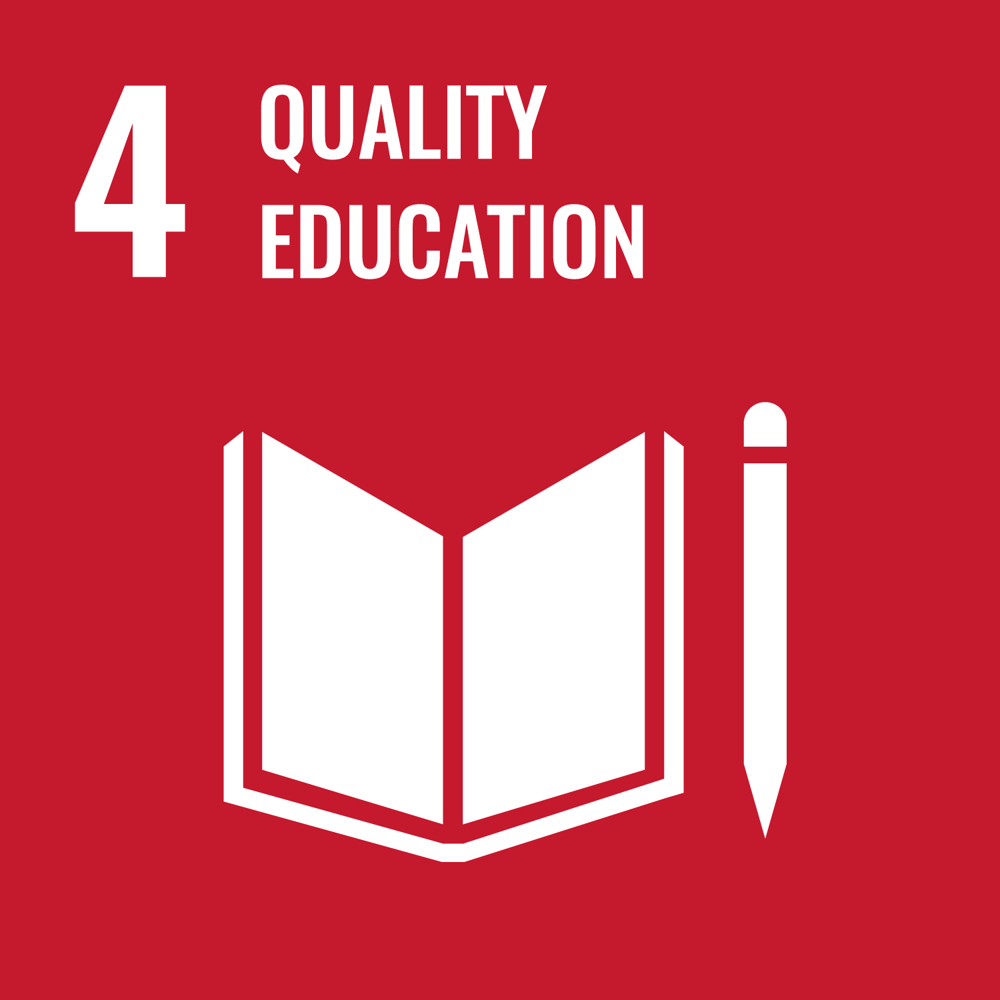{#C08_E-WEB-Goal-04-ref width="20%" fig-align="left"}

### Figure 0.0

**Licence**: CC BY-NC-SA

**Author/creator**: United Nations

**Source**: <https://sdgs.un.org/goals/goal8>

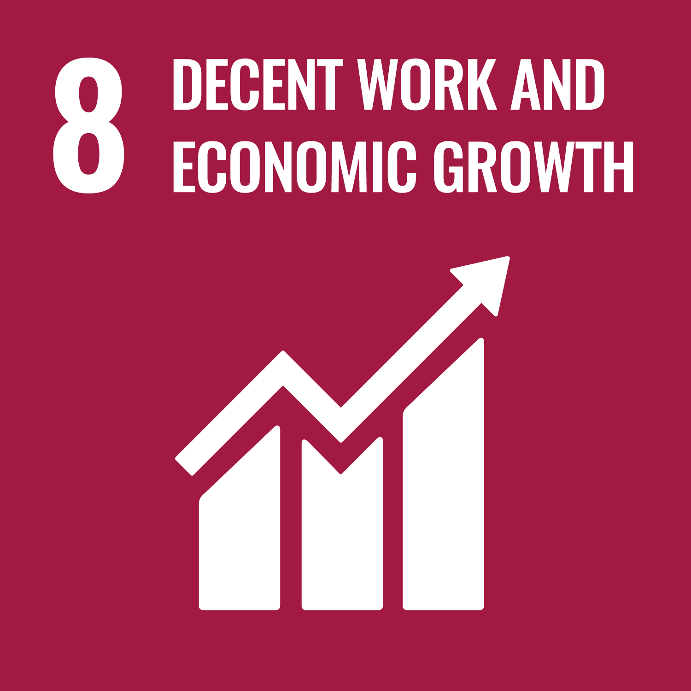{#C08_E-WEB-Goal-08-ref width="20%" fig-align="left"}

### Figure 0.0

**Licence**: CC BY-NC-SA

**Author/creator**: United Nations

**Source**: <https://sdgs.un.org/goals/goal10>

{#C08_E-WEB-Goal-10-ref width="20%" fig-align="left"}

### Figure 0.0

**Licence**: CC BY-NC-SA

**Author/creator**: United Nations

**Source**: <https://sdgs.un.org/goals/goal12>

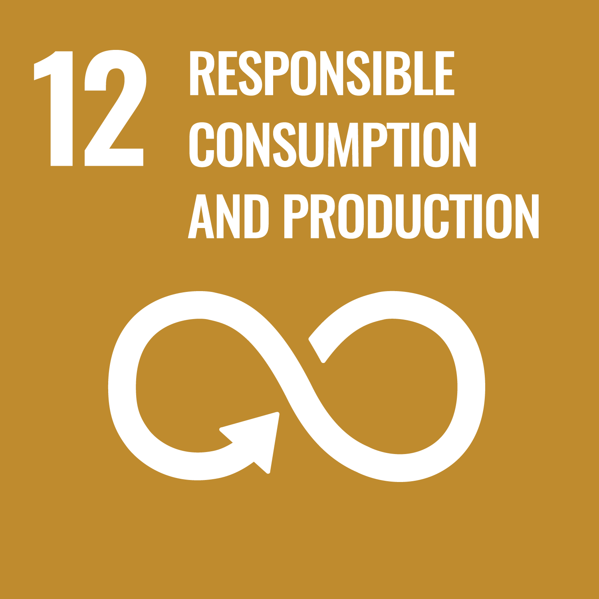{#C08_E-WEB-Goal-12-ref width="20%" fig-align="left"}

### Figure 0.0

**Licence**: CC BY-NC-SA

**Author/creator**: United Nations

**Source**: <https://sdgs.un.org/goals/goal16>

{#C08_E-WEB-Goal-16-ref width="20%" fig-align="left"}

## Chapter --- It Depends: How to Develop Judgement in Programming

### Figure 0.1

**Licence**: CC BY-NC-SA

**Author/creator**: John Wilson

**Source**: Author's own

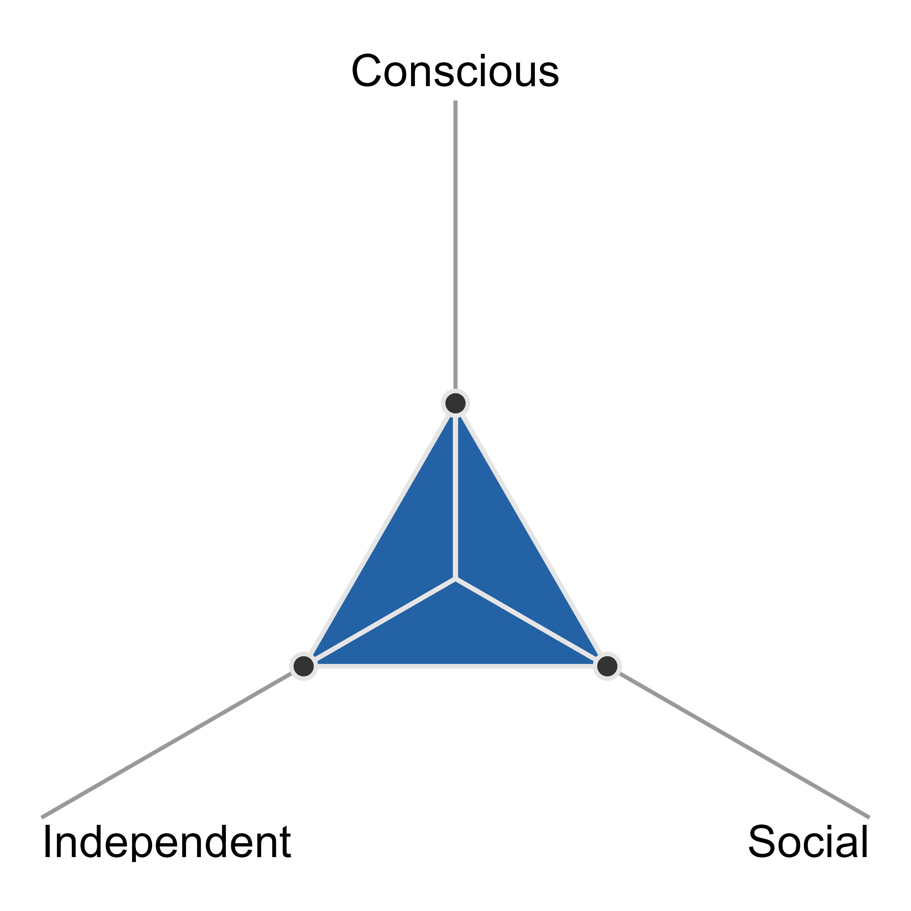{#C40_all-balanced-ref width="20%" fig-align="left"}

### Figure 0.2

**Licence**: CC BY-NC-SA

**Author/creator**: John Wilson

**Source**: Author's own

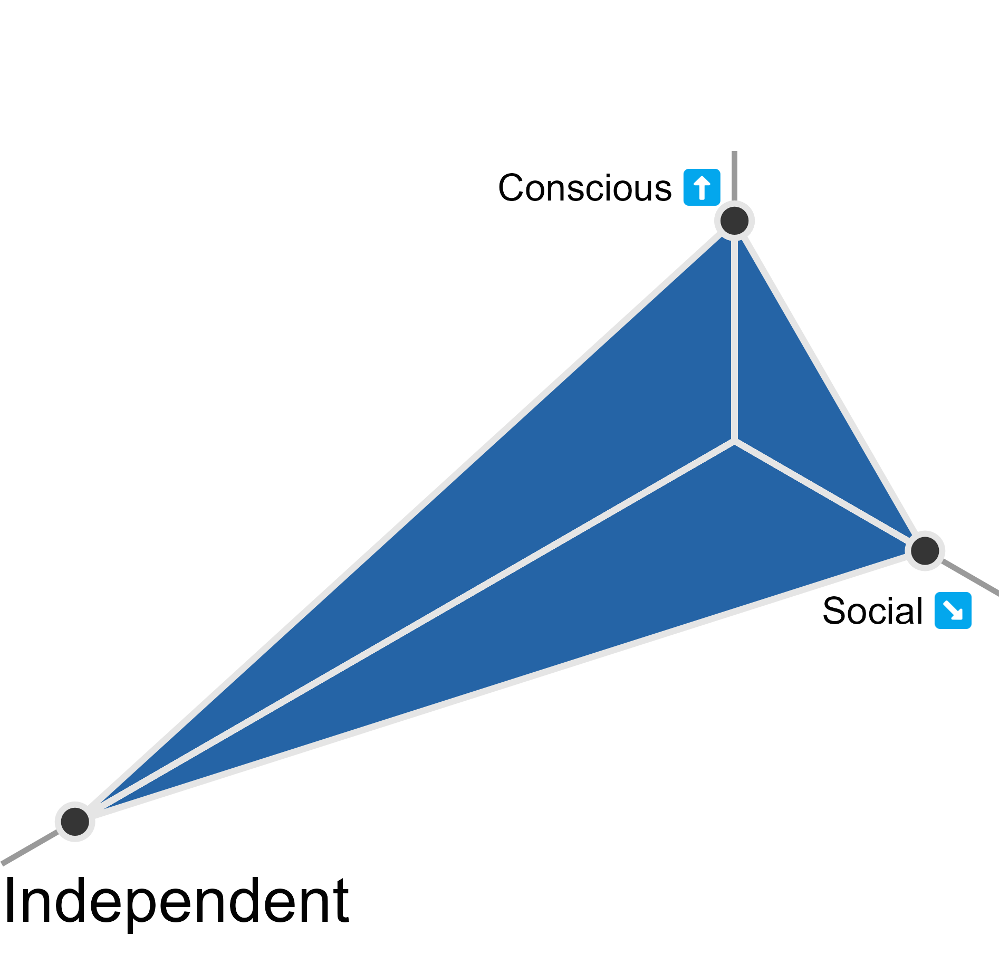{#C40_independent-zoomed-ref width="20%" fig-align="left"}

### Figure 0.3

**Licence**: CC BY-NC-SA

**Author/creator**: John Wilson

**Source**: Author's own

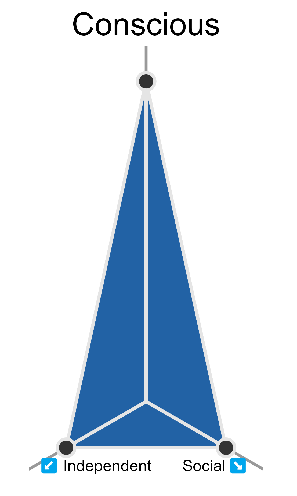{#C40_conscious-zoomed-ref width="20%" fig-align="left"}

### Figure 0.4

**Licence**: CC BY-NC-SA

**Author/creator**: John Wilson

**Source**: Author's own

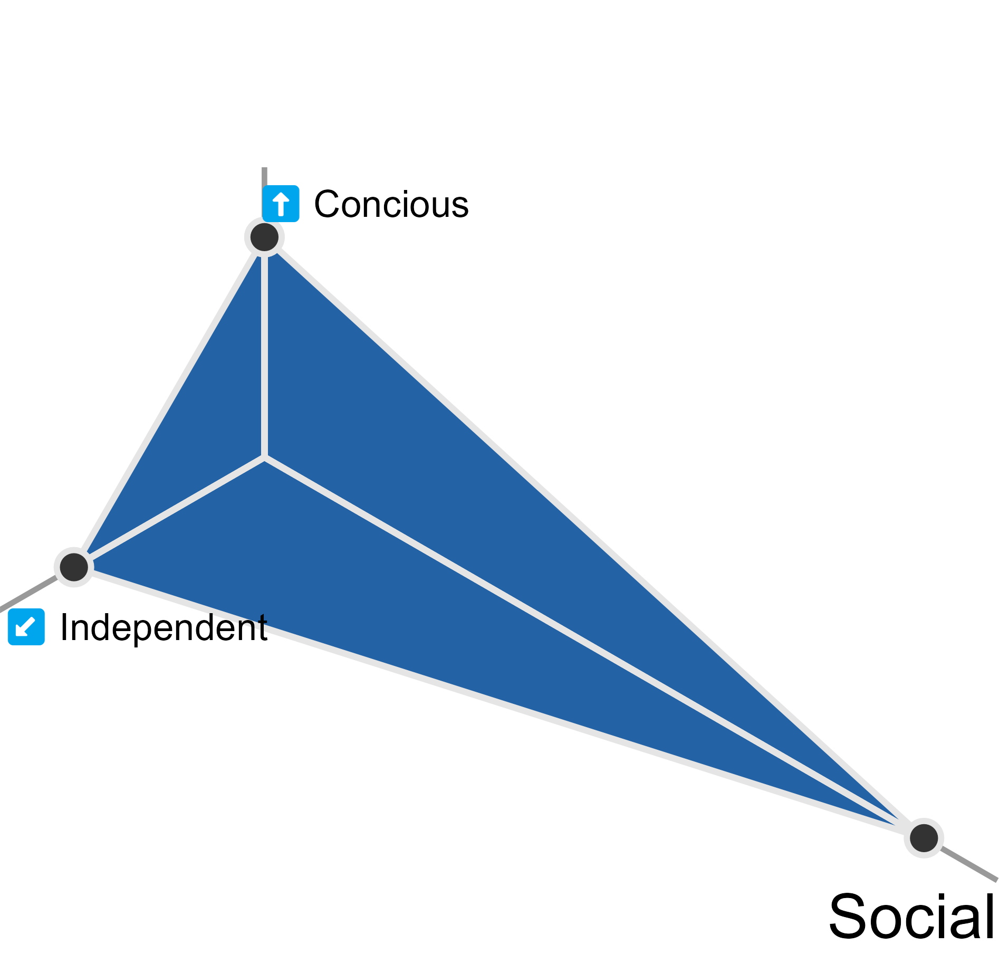{#C40_social-zoomed-ref width="20%" fig-align="left"}

### Figure 0.5

**Licence**: CC BY-NC-SA

**Author/creator**: John Wilson

**Source**: Author's own

**Notes**: online only

::: {.content-visible unless-format="html"}
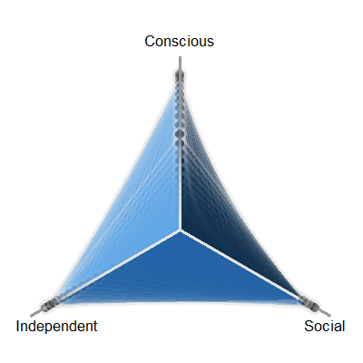{width="20%" fig-align="left"}
:::
::: {.content-visible when-format="html"}
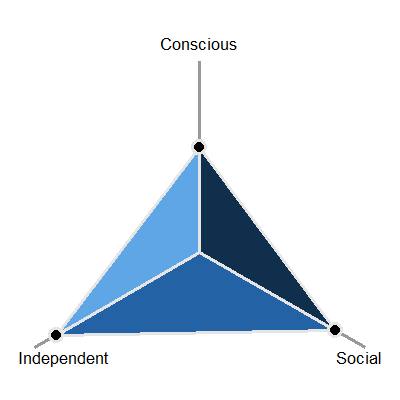{#C40_ir-radar-ref width="20%" fig-align="left"}
:::

### Figure 0.5

**Licence**: CC BY-NC-SA

**Author/creator**: John Wilson

**Source**: Author's own

**Notes**: print only

{width="20%" fig-align="left"}

### Figure 0.6

**Licence**: CC BY-NC-SA

**Author/creator**: Seren Wilson

**Source**: Author's own

{#C40_nutshell-ref width="20%" fig-align="left"}

## Chapter --- Where Do I Even Start With Pair Programming in My Classroom? A Conversation With Seasoned Practitioners

### Figure 2.1

**Licence**: CC BY-NC-SA

**Author/creator**: Pawel Orzechowski

**Source**: Author's own

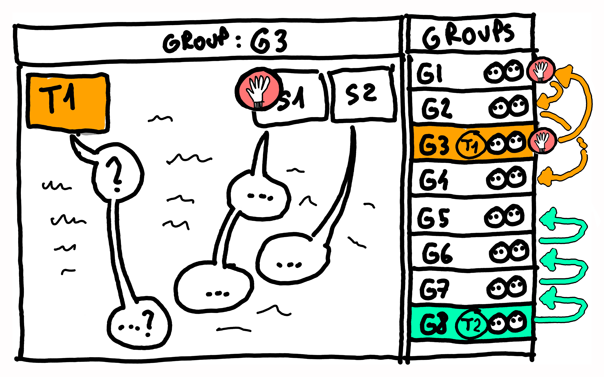{#C12_pair-programming-overview_breakout_rooms-ref width="20%" fig-align="left"}

### Figure 2.2

**Licence**: CC BY-NC-SA

**Author/creator**: Pawel Orzechowski

**Source**: Author's own

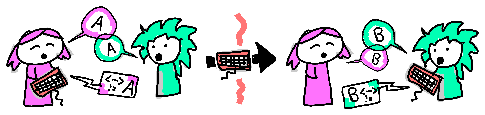{#C12_pair-programming-overview_keyboard_switch-ref width="20%" fig-align="left"}

### Figure 2.3

**Licence**: CC BY-NC-SA

**Author/creator**: Pawel Orzechowski

**Source**: Author's own

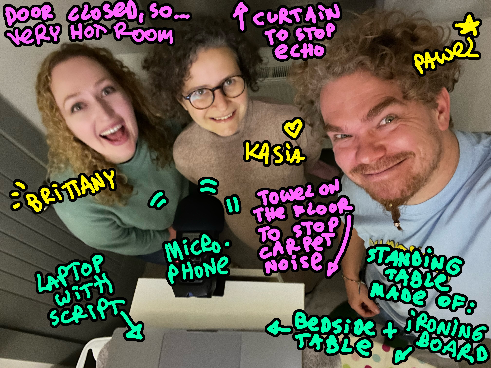{#C12_pair-programming-overview_podcast_recording-ref width="20%" fig-align="left"}

### Figure 2.4

**Licence**: CC BY-NC-SA

**Author/creator**: Pawel Orzechowski

**Source**: Author's own

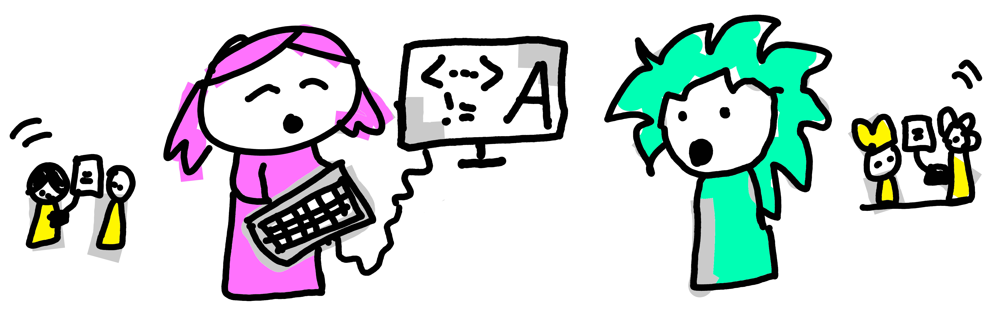{#C12_pair-programming-overview_two_students-ref width="20%" fig-align="left"}

## Chapter --- Structured Group Work With Assigned Asymmetrical Roles and Switching: Lessons From Pair Programming Across Disciplines

### Figure 3.1

**Licence**: CC BY-NC-SA

**Author/creator**: Pawel Orzechowski

**Source**: Author's own

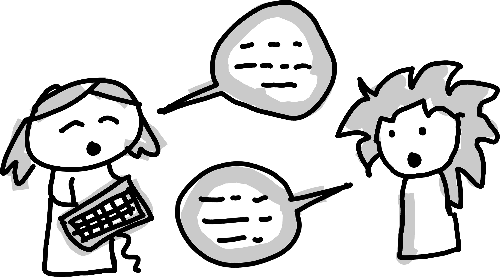{#C36_pair-programming-across-disciplines_driver_and_navigator_speak-ref width="20%" fig-align="left"}

### Figure 3.2

**Licence**: CC BY-NC-SA

**Author/creator**: Pawel Orzechowski

**Source**: Author's own

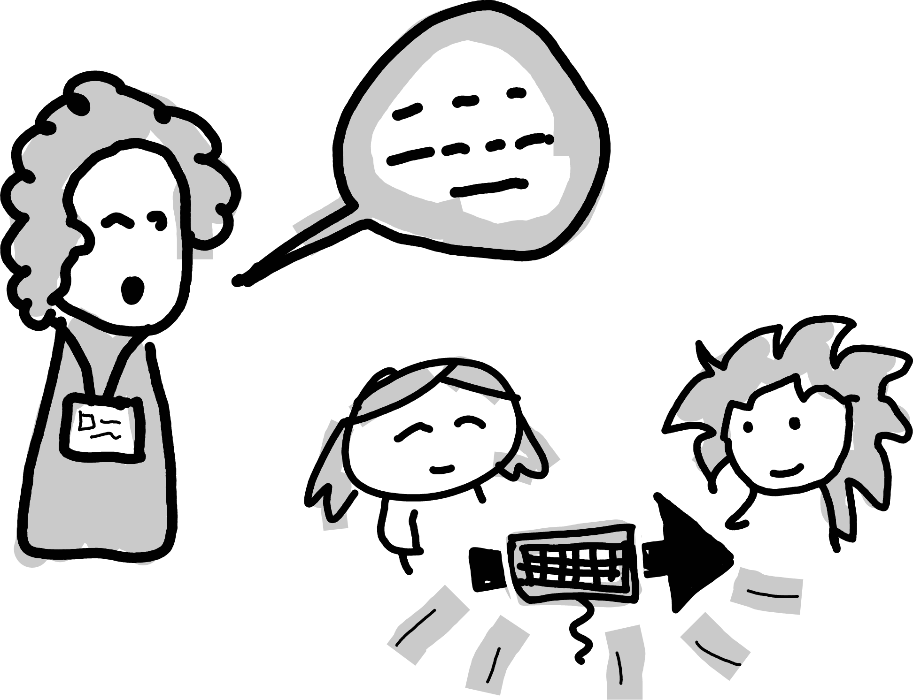{#C36_pair-programming-across-disciplines_tutor_helps-ref width="20%" fig-align="left"}

### Figure 3.3

**Licence**: CC BY-NC-SA

**Author/creator**: Pawel Orzechowski

**Source**: Author's own

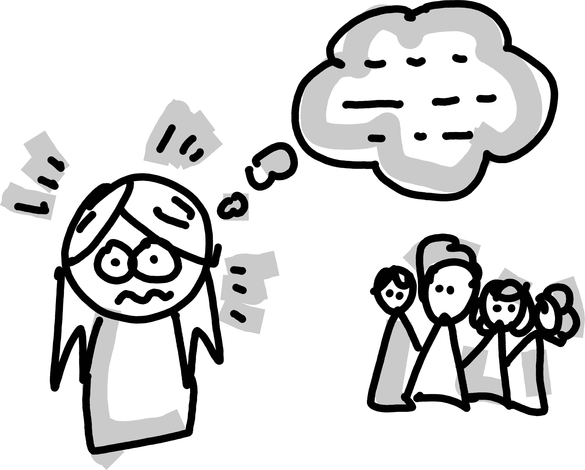{#C36_pair-programming-across-disciplines_group_anxiety-ref width="20%" fig-align="left"}

### Figure 3.4

**Licence**: CC BY-NC-SA

**Author/creator**: Pawel Orzechowski

**Source**: Author's own

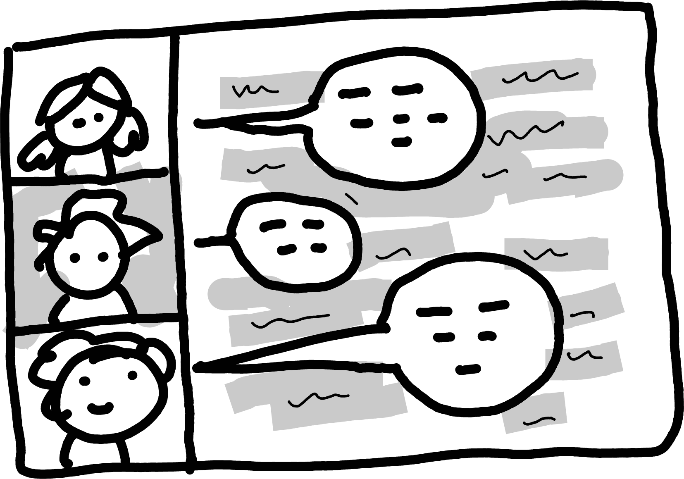{#C36_pair-programming-across-disciplines_online_ideas-ref width="20%" fig-align="left"}

## Chapter --- An Optimistic Outlook on Teaching, Learning and Assessment for Coding With the Emergence of Generative AI

### Figure 8.1

**Licence**: CC BY-NC-SA

**Author/creator**: Laila Dabab Nahas

**Source**: Author's own

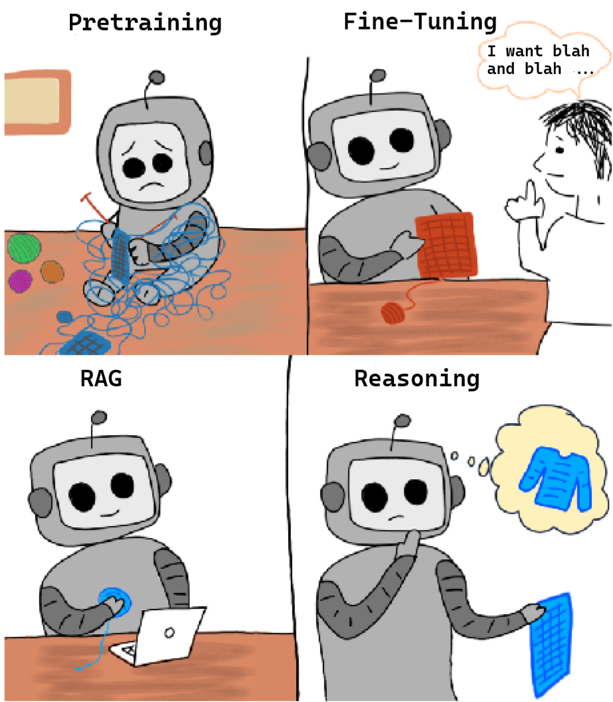{#C19_LLMs_development-ref width="20%" fig-align="left"}

## Chapter --- AI, Voice, and Style in Programming Education

### Figure 10.1

**Licence**: CC BY-NC-SA

**Author/creator**: John Wilson

**Source**: Author's own

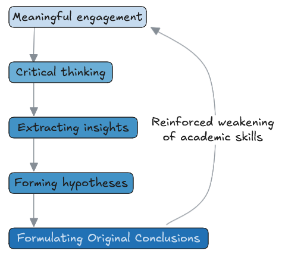{#C44_ai-vs-ac-flowchart-ref width="20%" fig-align="left"}

## Chapter --- Practices to Foster Inclusion and Accessibility in Programming Teaching

### Figure 12.1

**Licence**: CC BY-NC-SA

**Author/creator**: Pawel Orzechowski

**Source**: Author's own

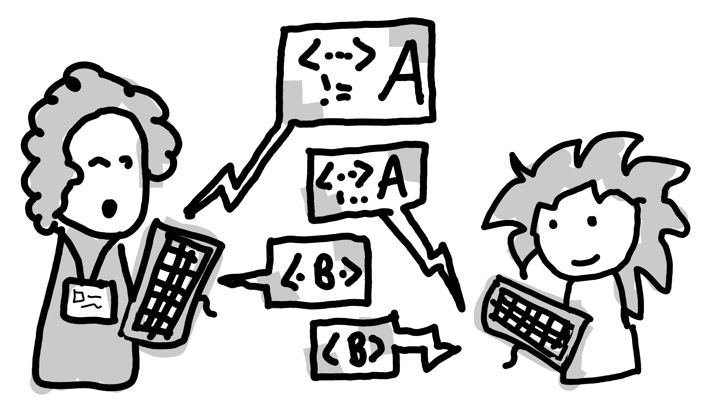{#c14-inclusion-codealong-ref width="20%" fig-align="left"}

### Figure 12.2

**Licence**: CC BY-NC-SA

**Author/creator**: Pawel Orzechowski

**Source**: Author's own

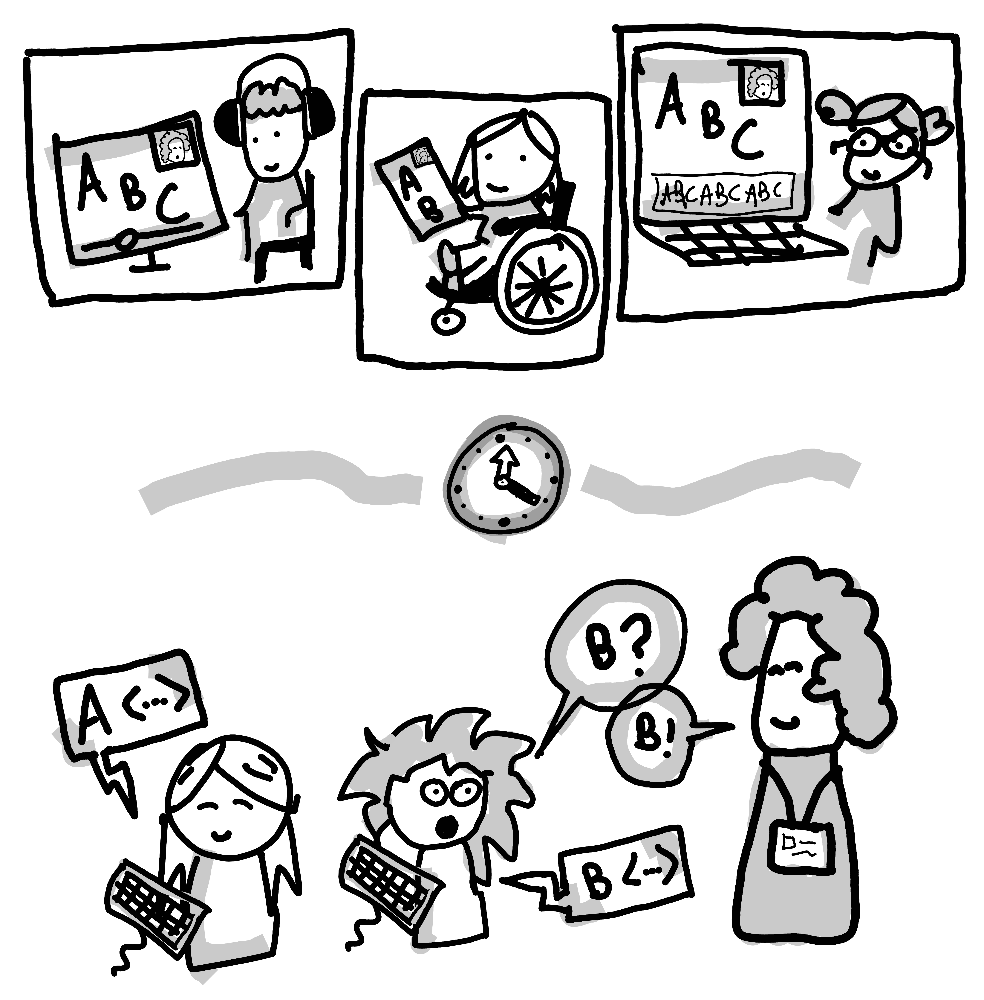{#c14-inclusion-flipped-ref width="20%" fig-align="left"}

### Figure 12.3

**Licence**: CC BY-NC-SA

**Author/creator**: Pawel Orzechowski

**Source**: Author's own

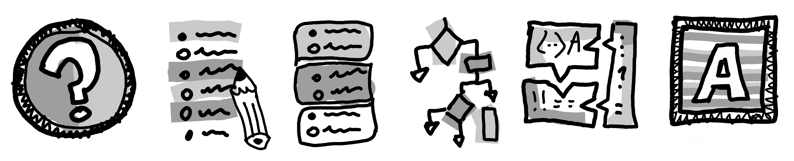{#c14-inclusion-modelling-line-ref width="20%" fig-align="left"}

### Figure 12.4

**Licence**: CC BY-NC-SA

**Author/creator**: Pawel Orzechowski

**Source**: Author's own

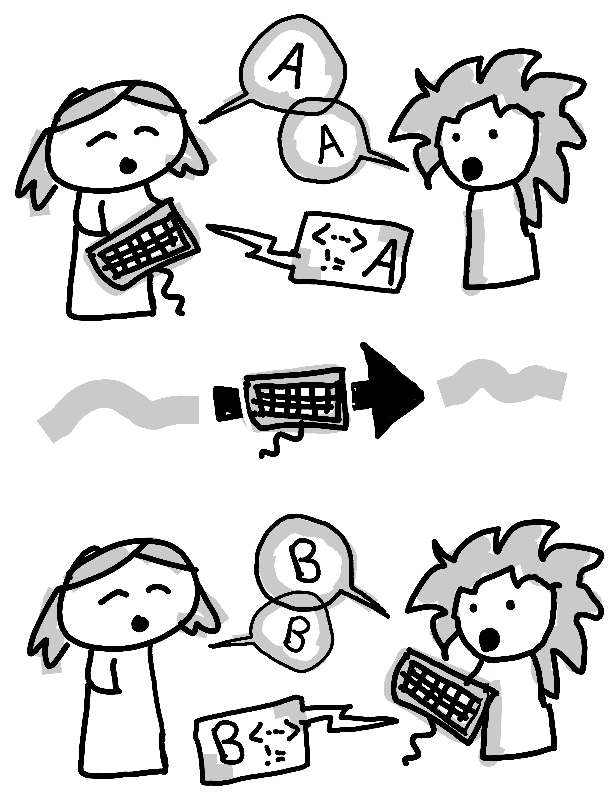{#c14-inclusion-pair-prog-ref width="20%" fig-align="left"}

### Figure 12.5

**Licence**: CC BY-NC-SA

**Author/creator**: Pawel Orzechowski

**Source**: Author's own

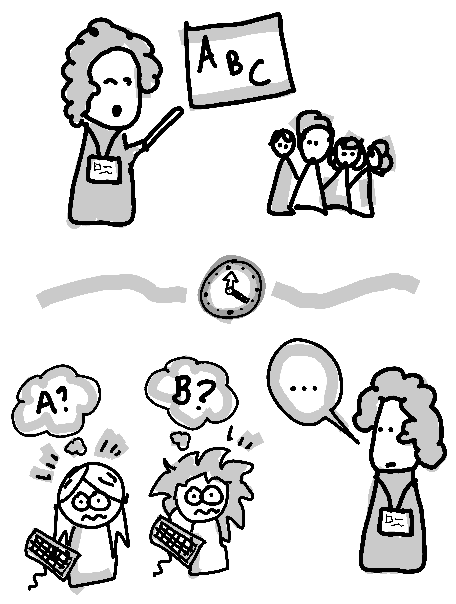{#c14-inclusion-lecture-lab-ref width="20%" fig-align="left"}

### Figure 12.6

**Licence**: CC BY-NC-SA

**Author/creator**: Pawel Orzechowski

**Source**: Author's own

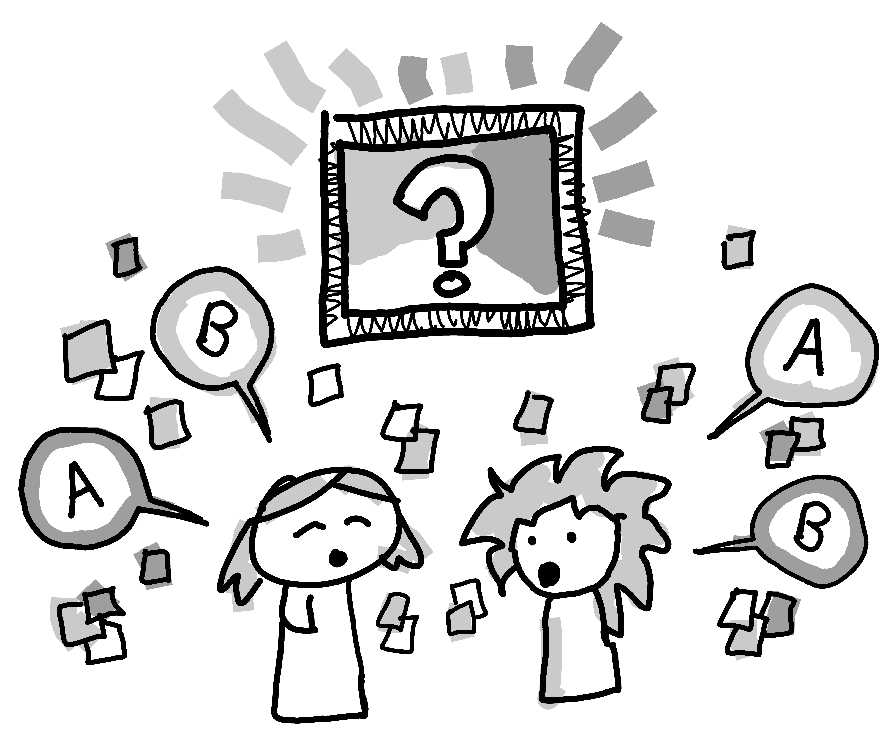{#c14-inclusion-discovery-ref width="20%" fig-align="left"}

## Chapter --- Overcoming Coding Anxiety: Lowering the Stakes and Making It Fun

### Figure 13.1

**Licence**: CC BY-NC-SA

**Author/creator**: The Square Comic

**Source**: <https://www.thesquarecomics.com/>

**Notes**: Via <https://www.reddit.com/user/yuva-krishna-memes/>

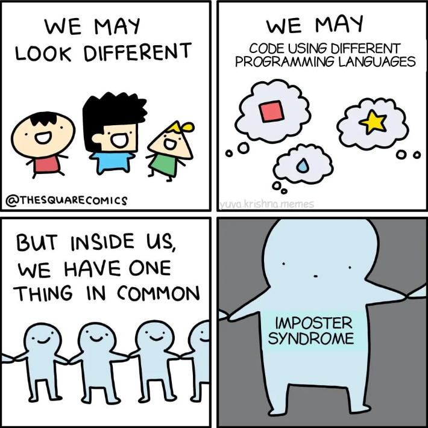{#C33_coding-anxiety_humour-ref width="20%" fig-align="left"}

## Chapter --- Computer Says No: Reducing Technical Barriers to Help Novice Programmers

### Figure 13.1

**Licence**: CC BY-NC-SA

**Author/creator**: Lizzie Wadsworth

**Source**: Author's own

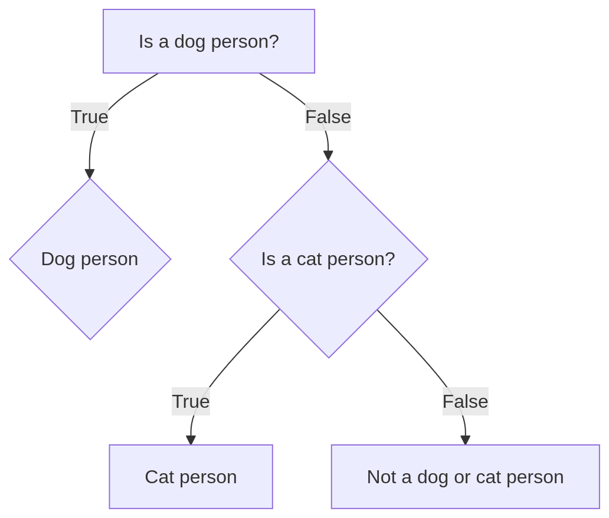{#C04_computer-says-no-flowchart-ref width="20%" fig-align="left"}

## Chapter --- Overcoming Coding Anxiety: Lowering the Stakes and Making It Fun

### Figure 13.2

**Licence**: CC BY-NC-SA

**Author/creator**: Maria Zacarias

**Source**: Adapted from <https://www.mentalyc.com/>

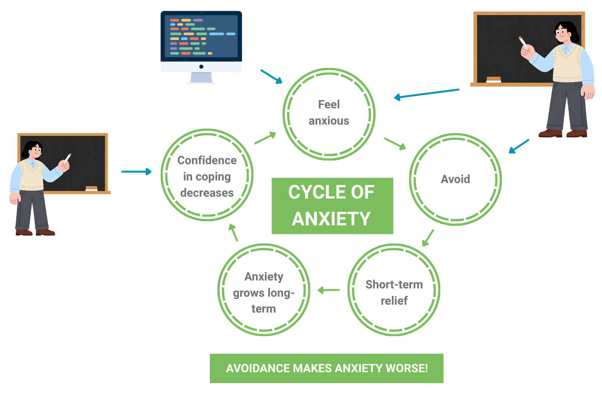{#C33_coding-anxiety_cycle-ref width="20%" fig-align="left"}

## Chapter --- Computer Says No: Reducing Technical Barriers to Help Novice Programmers

### Figure 13.2

**Licence**: CC BY-NC-SA

**Author/creator**: Lizzie Wadsworth

**Source**: Author's own

**Notes**: online only

::: {.content-visible unless-format="html"}
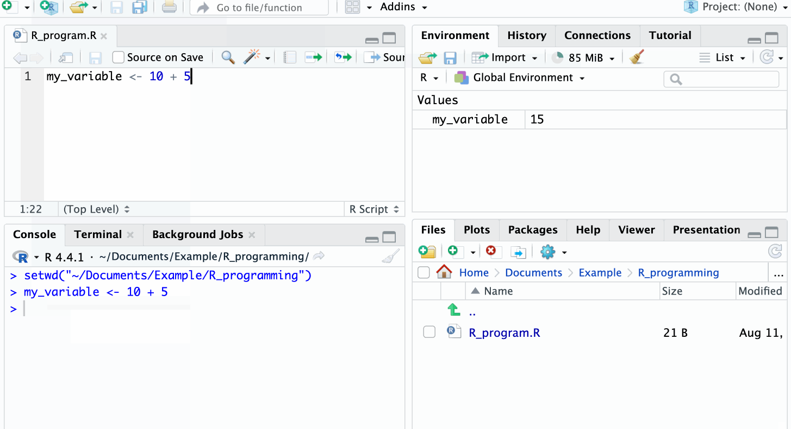{width="20%" fig-align="left"}
:::
::: {.content-visible when-format="html"}
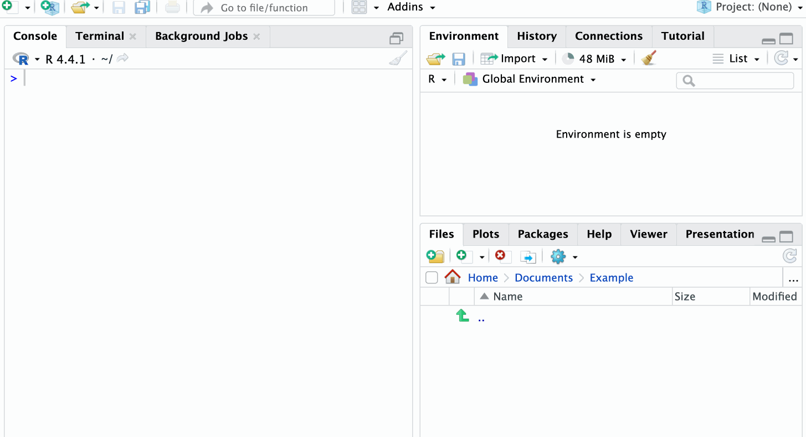{#C04_RStudio_GIF_demonstration-ref width="20%" fig-align="left"}
:::

### Figure 13.2

**Licence**: CC BY-NC-SA

**Author/creator**: Lizzie Wadsworth

**Source**: Author's own

**Notes**: print only

{width="20%" fig-align="left"}

## Chapter --- Overcoming Coding Anxiety: Lowering the Stakes and Making It Fun

### Figure 13.3

**Licence**: CC BY-NC-SA

**Author/creator**: Pratik Gupte

**Source**: Reused with the author's permission.

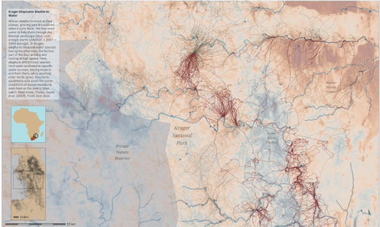{#C33_coding-anxiety_move-ref width="20%" fig-align="left"}

## Chapter --- Computer Says No: Reducing Technical Barriers to Help Novice Programmers

### Figure 13.3

**Licence**: CC BY-NC-SA

**Author/creator**: Lizzie Wadsworth

**Source**: Author's own

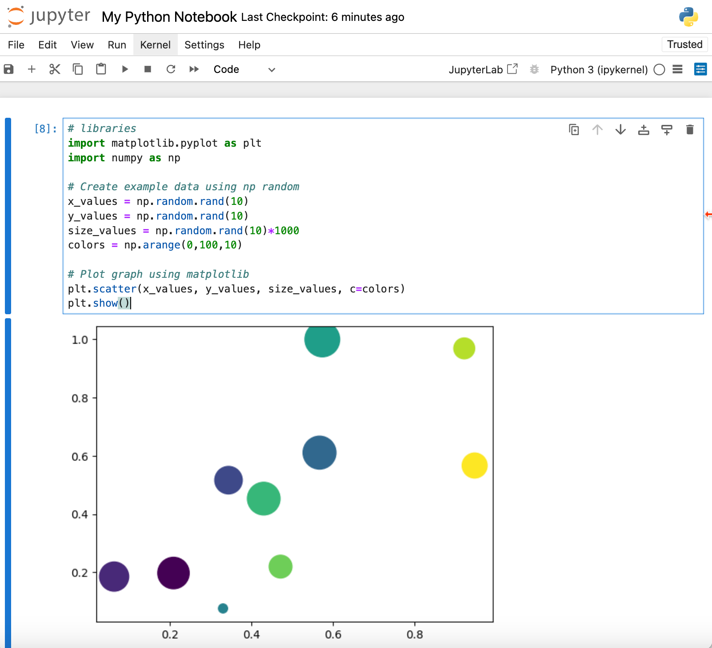{#C04_computer-says-no-jupyter-notebook-ref width="20%" fig-align="left"}

## Chapter --- Overcoming Coding Anxiety: Lowering the Stakes and Making It Fun

### Figure 13.4

**Licence**: CC BY-NC-SA

**Author/creator**: Tiago Marques

**Source**: Author's own

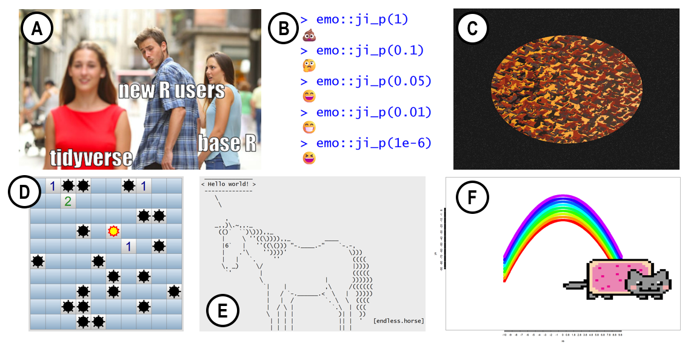{#C33_coding-anxiety_memes-ref width="20%" fig-align="left"}

## Chapter --- Computer Says No: Reducing Technical Barriers to Help Novice Programmers

### Figure 13.4

**Licence**: CC BY-NC-SA

**Author/creator**: Lizzie Wadsworth

**Source**: Author's own

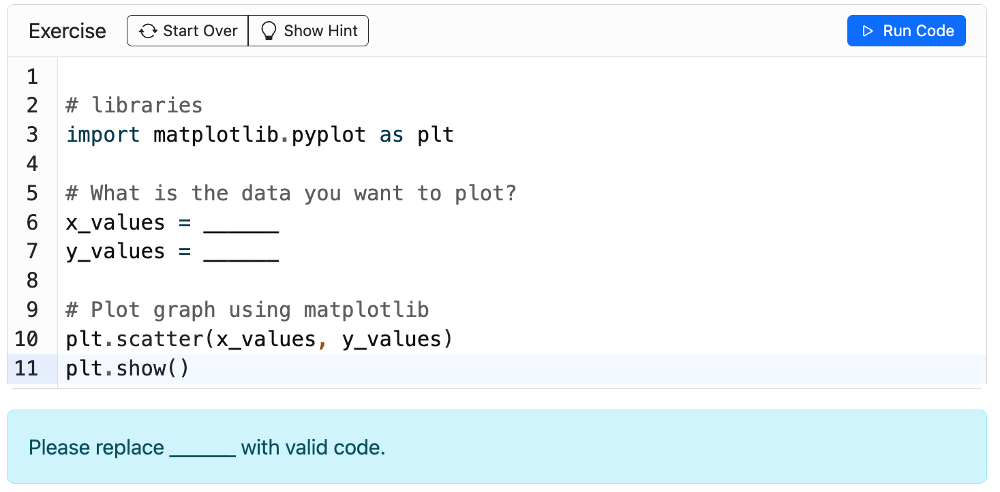{#C04_computer-says-no-quatro-live-exercise-ref width="20%" fig-align="left"}

## Chapter --- Overcoming Coding Anxiety: Lowering the Stakes and Making It Fun

### Figure 13.5

**Licence**: CC BY-NC-SA

**Author/creator**: Maria Zacarias

**Source**: Author's own

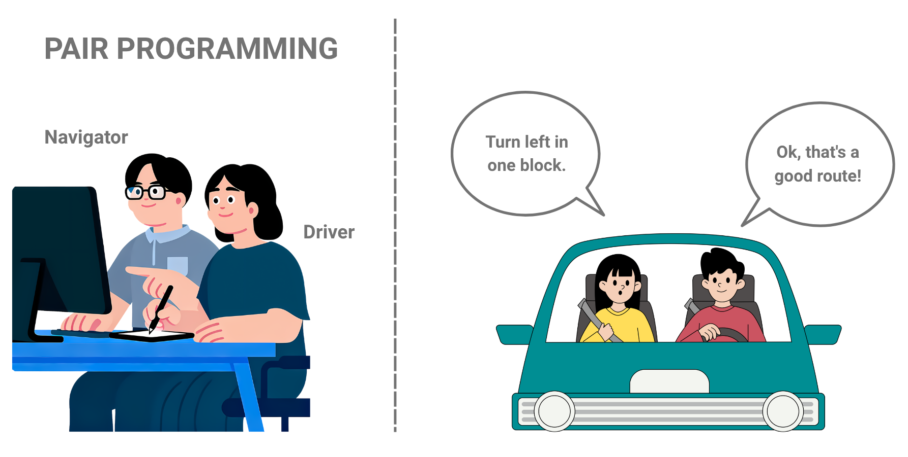{#C33_coding-anxiety_pair-ref width="20%" fig-align="left"}

## Chapter --- Computer Says No: Reducing Technical Barriers to Help Novice Programmers

### Figure 13.5

**Licence**: CC BY-NC-SA

**Author/creator**: xkcd

**Source**: <https://xkcd.com/>

**Notes**: <https://xkcd.com/license.html>

{#C04_computer-says-no-xkcd-dependency-ref width="20%" fig-align="left"}

## Chapter --- Peer Programming in Action: Pair Programming in Larger Groups

### Figure 14.1

**Licence**: CC BY-NC-SA

**Author/creator**: Umberto Noe

**Source**: Author's own

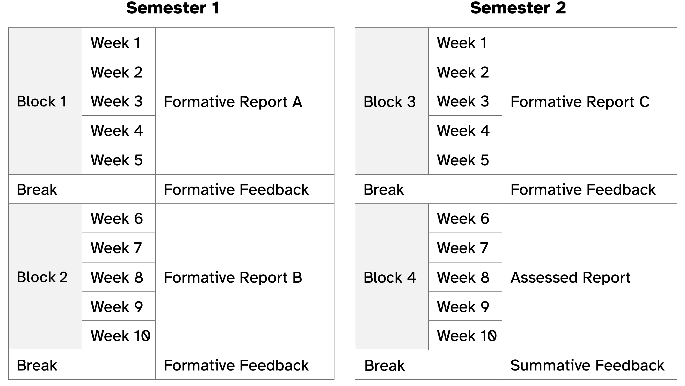{#C16_peer-programming_course-structure-ref width="20%" fig-align="left"}

### Figure 14.2

**Licence**: CC BY-NC-SA

**Author/creator**: Eileen Xu

**Source**: Author's own

{#C16_peer-programming_teaching-room-ref width="20%" fig-align="left"}

## Chapter --- Leveraging the Heterogeneity: Teaching Computing Skills to a Multidisciplinary Cohort With a Variable Skill Level

### Figure 15.1

**Licence**: CC BY-NC-SA

**Author/creator**: Jonathon Holt

**Source**: Author's own

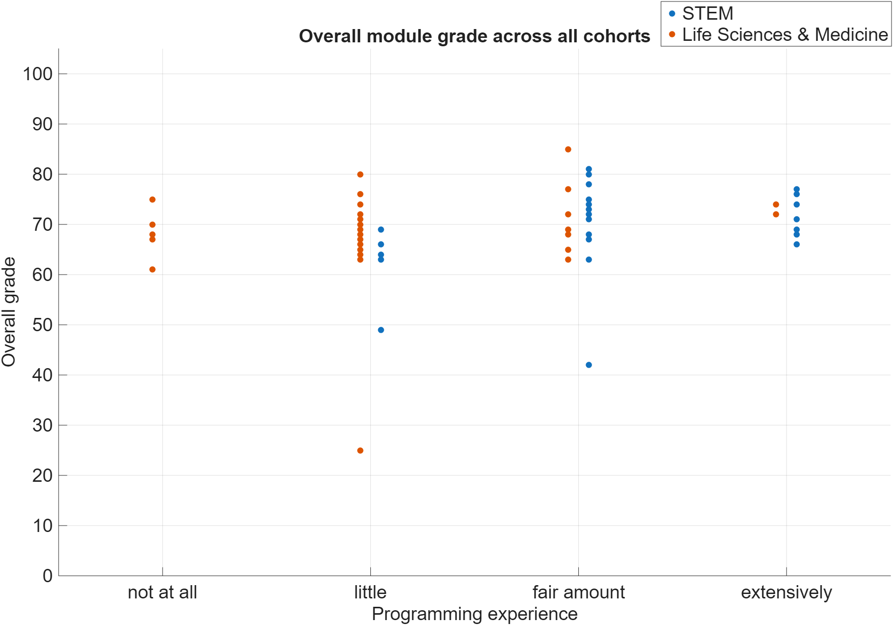{#C31_leveraging_heterogeneity_fig1-ref width="20%" fig-align="left"}

## Chapter --- 3 Stars and 1 Wish: Small and Frequent Student Reflections Promote a Sense of Wonder and a Community of Vulnerability

### Figure 15.1

**Licence**: CC BY-NC-SA

**Author/creator**: Pawel Orzechowski

**Source**: Author's own

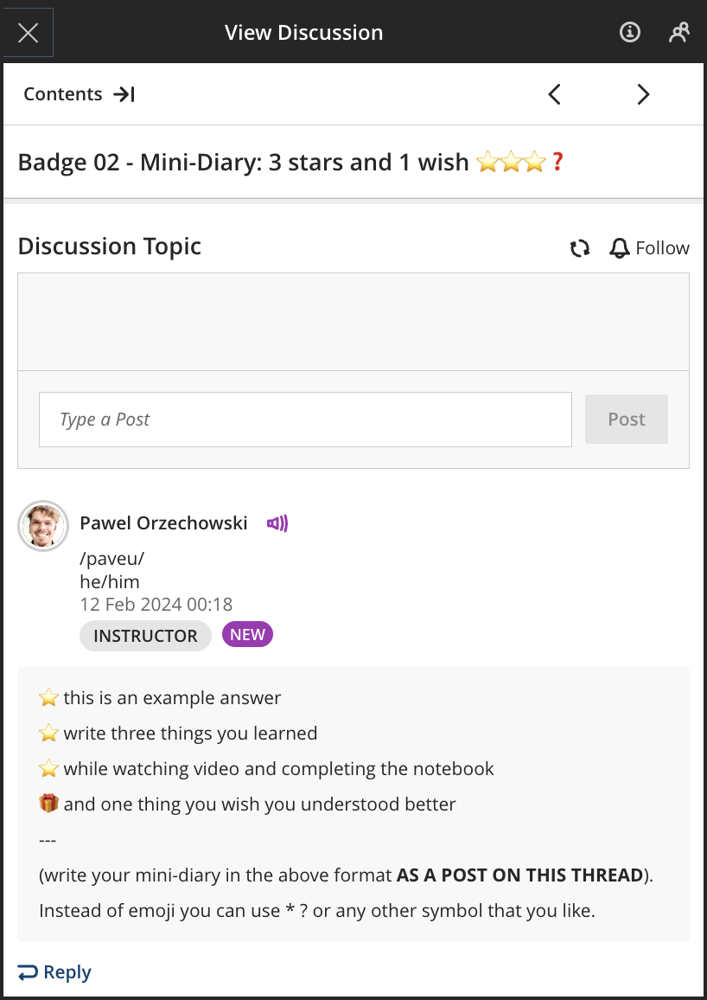{#c34-3s1w-post-prompt-ref width="20%" fig-align="left"}

## Chapter --- Leveraging the Heterogeneity: Teaching Computing Skills to a Multidisciplinary Cohort With a Variable Skill Level

### Figure 15.2

**Licence**: CC BY-NC-SA

**Author/creator**: Jonathan Holt

**Source**: Author's own

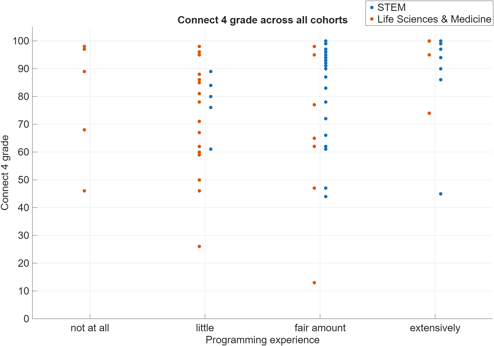{#C31_leveraging_heterogeneity_fig2-ref width="20%" fig-align="left"}

## Chapter --- 3 Stars and 1 Wish: Small and Frequent Student Reflections Promote a Sense of Wonder and a Community of Vulnerability

### Figure 15.2

**Licence**: CC BY-NC-SA

**Author/creator**: Pawel Orzechowski

**Source**: Author's own

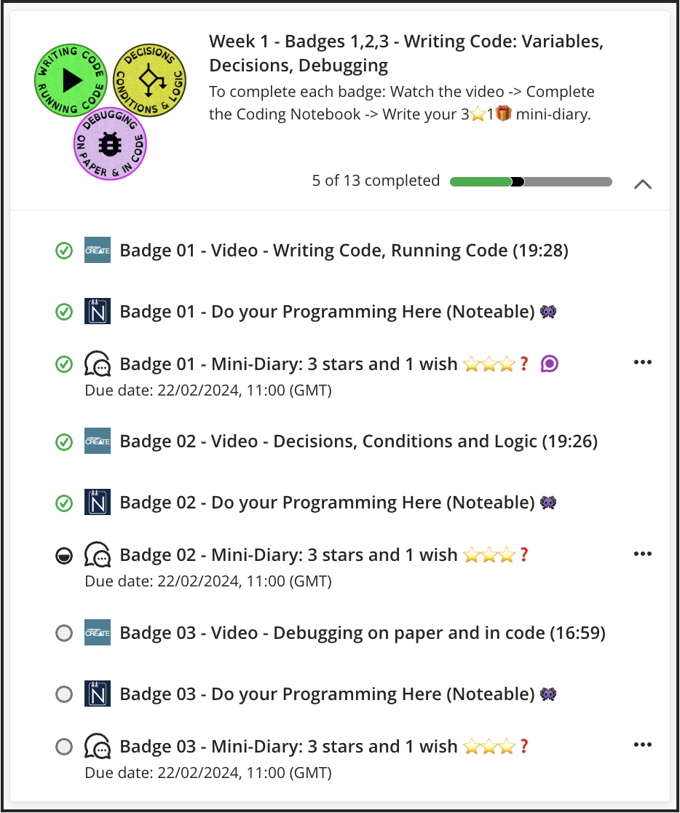{#c34-3s1w-course-structure-ref width="20%" fig-align="left"}

## Chapter --- Learning Together Across Modes: Online and On-Site Pair Programming in a Fusion Course

### Figure 16.1

**Licence**: CC BY-NC-SA

**Author/creator**: Pawel Orzechowski

**Source**: Author's own

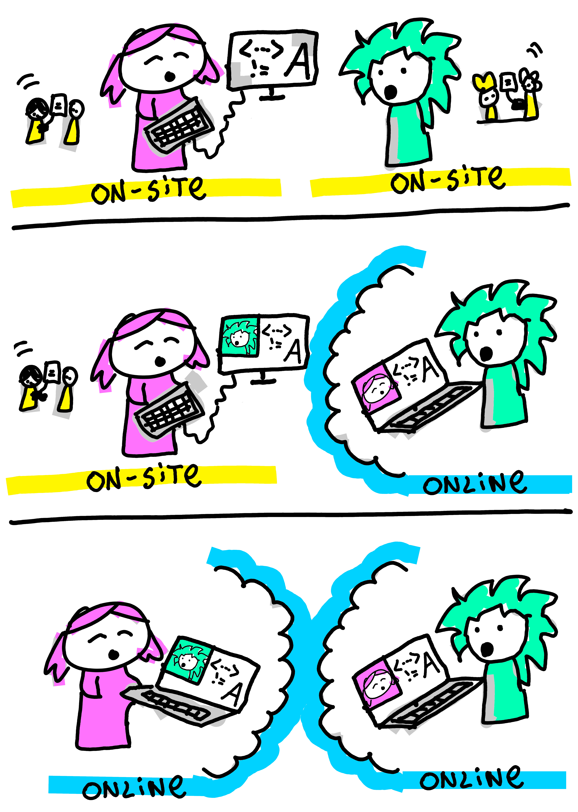{#C23_pair-programming-fusion-modes-ref width="20%" fig-align="left"}

### Figure 16.2

**Licence**: CC BY-NC-SA

**Author/creator**: Pawel Orzechowski

**Source**: Author's own

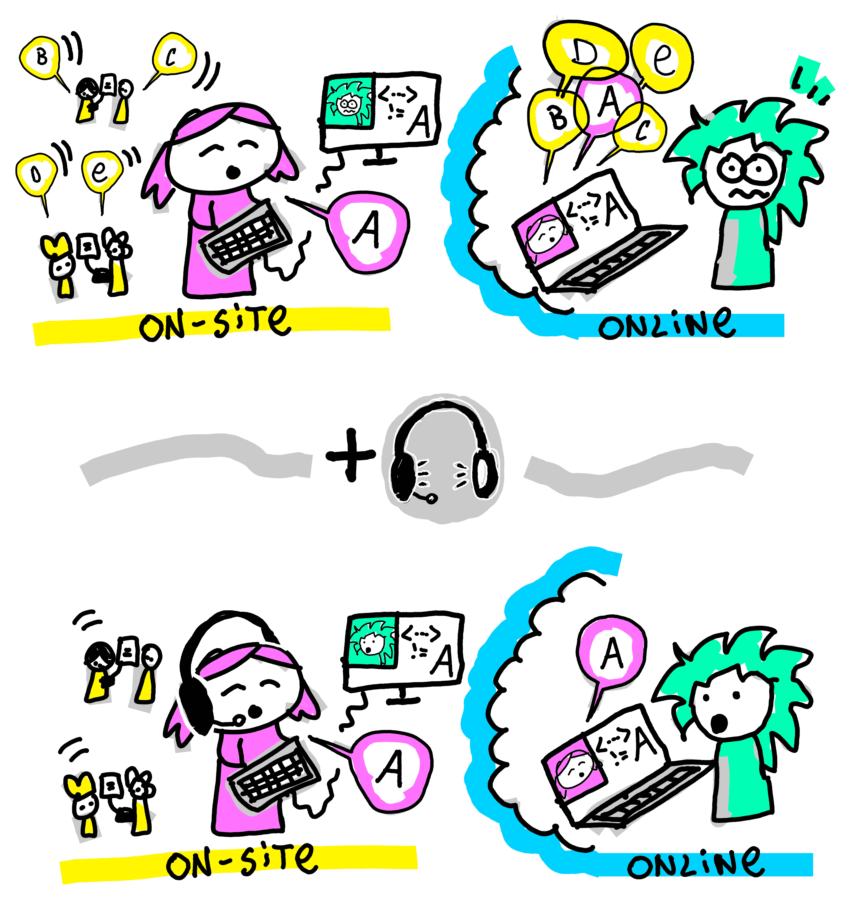{#C23_pair-programming-fusion-noisy-background-ref width="20%" fig-align="left"}

### Figure 16.3

**Licence**: CC BY-NC-SA

**Author/creator**: Pawel Orzechowski

**Source**: Author's own

{#C23_pair-programming-fusion-ghost-helper-ref width="20%" fig-align="left"}

### Figure 16.4

**Licence**: CC BY-NC-SA

**Author/creator**: Pawel Orzechowski

**Source**: Author's own

::: {.content-visible unless-format="html"}
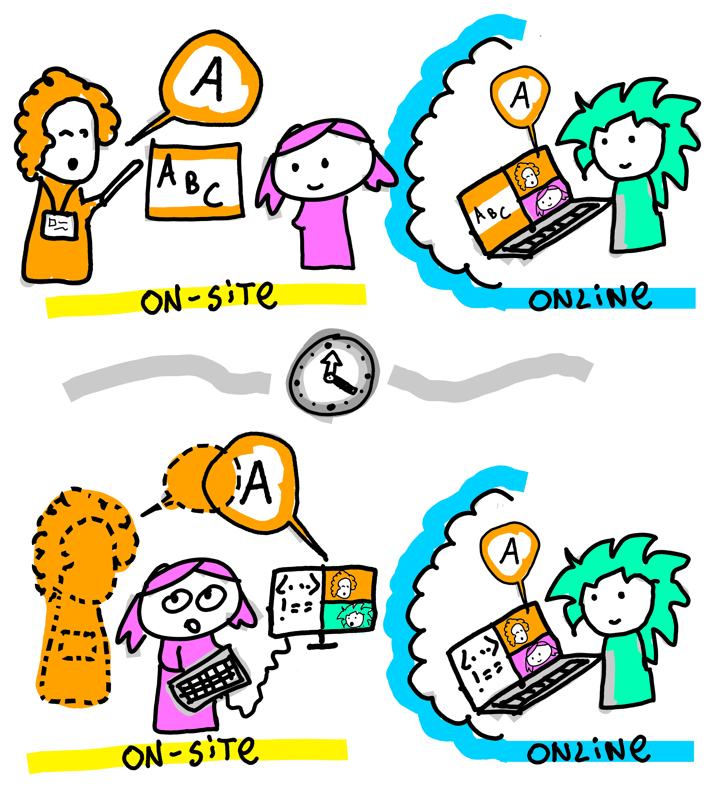{width="20%" fig-align="left"}
:::
::: {.content-visible when-format="html"}
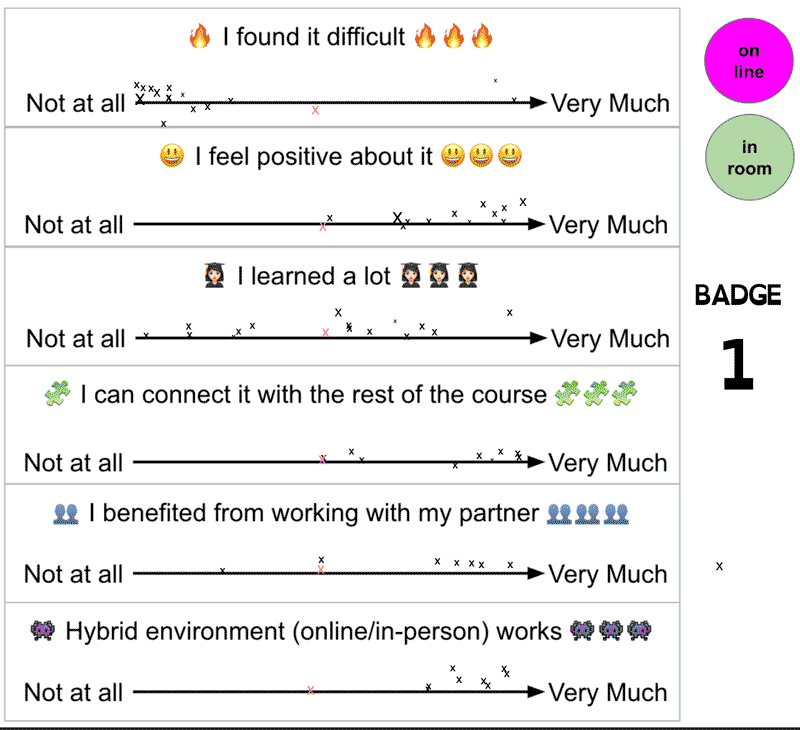{#C23_pair-programming-fusion-relentless-feedback-gif-ref width="20%" fig-align="left"}
:::

### Figure 16.4

**Licence**: CC BY-NC-SA

**Author/creator**: Pawel Orzechowski

**Source**: Author's own

{width="20%" fig-align="left"}

### Figure 16.5

**Licence**: CC BY-NC-SA

**Author/creator**: Pawel Orzechowski

**Source**: Author's own

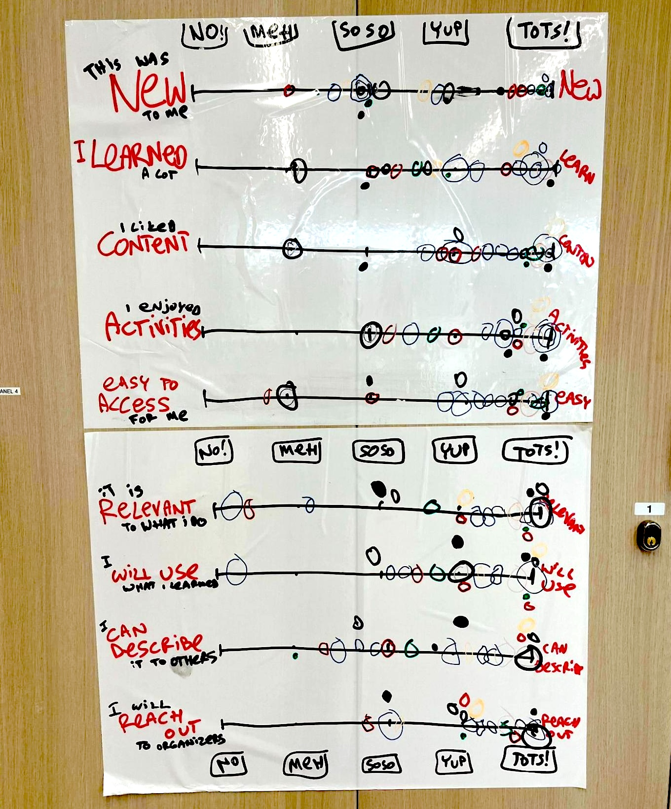{#C23_pair-programming-fusion-relentless-feedback-sharpie-ref width="20%" fig-align="left"}

### Figure 16.6

**Licence**: CC BY-NC-SA

**Author/creator**: Pawel Orzechowski

**Source**: Author's own

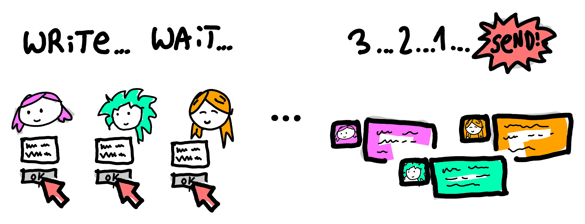{#C23_pair-programming-fusion-chat-blast-ref width="20%" fig-align="left"}

## Chapter --- Notebook for Novices? Pros and Cons of Jupyter

### Figure 18.1

**Licence**: CC BY-NC-SA

**Author/creator**: Joseph El Gemayel

**Source**: Author's own

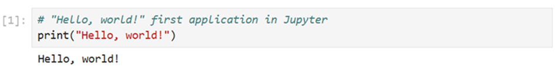{#C29_Figure1-ref width="20%" fig-align="left"}

### Figure 18.1

**Licence**: CC BY-NC-SA

**Author/creator**: Joseph El Gemayel

**Source**: Author's own

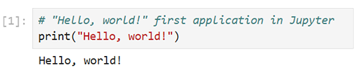{#C29_Figure1_narrow-ref width="20%" fig-align="left"}

### Figure 18.2

**Licence**: CC BY-NC-SA

**Author/creator**: Joseph El Gemayel

**Source**: Author's own

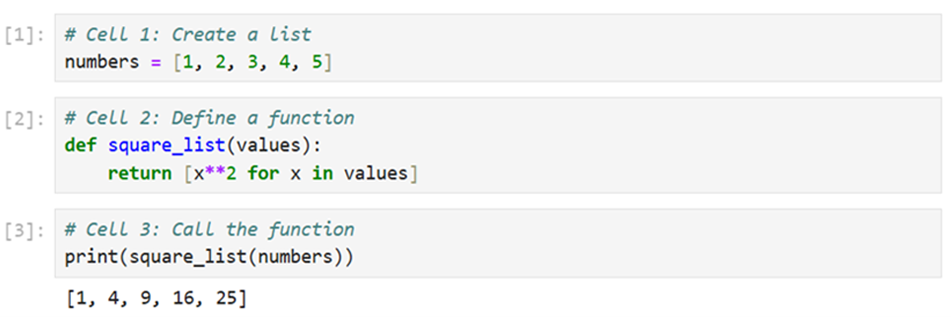{#C29_Figure2-ref width="20%" fig-align="left"}

### Figure 18.2

**Licence**: CC BY-NC-SA

**Author/creator**: Joseph El Gemayel

**Source**: Author's own

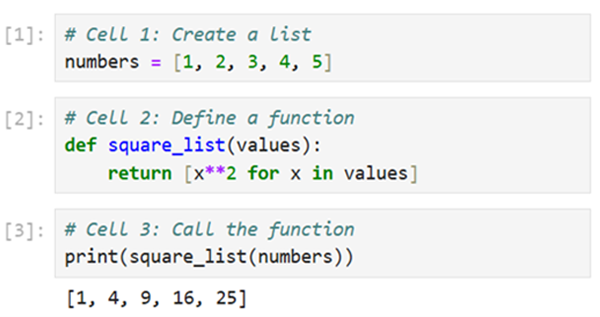{#C29_Figure2_narrow-ref width="20%" fig-align="left"}

### Figure 18.3

**Licence**: CC BY-NC-SA

**Author/creator**: Joseph El Gemayel

**Source**: Author's own

{#C29_Figure3-ref width="20%" fig-align="left"}

### Figure 18.3

**Licence**: CC BY-NC-SA

**Author/creator**: Joseph El Gemayel

**Source**: Author's own

{#C29_Figure3_narrow-ref width="20%" fig-align="left"}

### Figure 18.4

**Licence**: CC BY-NC-SA

**Author/creator**: William Bell

**Source**: Author's own

{#C29_Figure4-ref width="20%" fig-align="left"}

### Figure 18.5

**Licence**: CC BY-NC-SA

**Author/creator**: William Bell

**Source**: Author's own

{#C29_Figure5-ref width="20%" fig-align="left"}

### Figure 18.6

**Licence**: CC BY-NC-SA

**Author/creator**: William Bell

**Source**: Author's own

{#C29_Figure6-ref width="20%" fig-align="left"}

## Chapter --- Removing Barriers By Programming Without Computers

### Figure 21.1

**Licence**: CC BY-NC-SA

**Author/creator**: David Cutting

**Source**: Author's own

{#C15_pb3-ref width="20%" fig-align="left"}

## Chapter --- Seeing Before Coding, Doodling Before Doing: How Teaching Data Visualisation Transforms the Way Students Think

### Figure 23.1

**Licence**: CC BY-NC-SA

**Author/creator**: Suzanne Goopy

**Source**: Author's own

{#C43-data-vis_table-ref width="20%" fig-align="left"}

### Figure 23.2

**Licence**: CC BY-NC-SA

**Author/creator**: Suzanne Goopy

**Source**: Author's own

{#C43-data-vis_hand-ref width="20%" fig-align="left"}

### Figure 23.3

**Licence**: CC BY-NC-SA

**Author/creator**: Suzanne Goopy

**Source**: Author's own

{#C43-data-vis_sheet1-ref width="20%" fig-align="left"}

### Figure 23.4

**Licence**: CC BY-NC-SA

**Author/creator**: Suzanne Goopy

**Source**: Author's own

{#C43-data-vis_ideas-ref width="20%" fig-align="left"}

### Figure 23.5

**Licence**: CC BY-NC-SA

**Author/creator**: Suzanne Goopy

**Source**: Author's own

{#C43-data-vis_corrections-ref width="20%" fig-align="left"}

### Figure 23.6

**Licence**: CC BY-NC-SA

**Author/creator**: Suzanne Goopy

**Source**: Author's own

{#C43-data-vis_sketch-ref width="20%" fig-align="left"}

### Figure 23.7

**Licence**: CC BY-NC-SA

**Author/creator**: Suzanne Goopy

**Source**: Author's own

{#C43-data-vis_presentation-ref width="20%" fig-align="left"}

### Figure 23.8

**Licence**: CC BY-NC-SA

**Author/creator**: Suzanne Goopy

**Source**: Author's own

{#C43-data-vis_records-ref width="20%" fig-align="left"}

### Figure 23.9

**Licence**: CC BY-NC-SA

**Author/creator**: Suzanne Goopy

**Source**: Author's own

{#C43-data-vis_map-ref width="20%" fig-align="left"}

## Chapter --- Developing a Skills-Based Framework for Assessments in Programming Courses

### Figure 24.1

**Licence**: CC BY-NC-SA

**Author/creator**: Elizabeth Pankratz

**Source**: Author's own

{#C38_skills-based-assessment_levels-ref width="20%" fig-align="left"}

## Chapter --- Using Automated Marking in Programming Courses to Enhance Learning

### Figure 28.1

**Licence**: CC BY-NC-SA

**Author/creator**: Leila Shafti

**Source**: Author's own

{#C20_Figure1-ref width="20%" fig-align="left"}

### Figure 28.2

**Licence**: CC BY-NC-SA

**Author/creator**: Leila Shafti

**Source**: Author's own

{#C20_Figure2-ref width="20%" fig-align="left"}

### Figure 28.3

**Licence**: CC BY-NC-SA

**Author/creator**: Leila Shafti

**Source**: Author's own

{#C20_Figure3-ref width="20%" fig-align="left"}

### Figure 28.4

**Licence**: CC BY-NC-SA

**Author/creator**: Leila Shafti

**Source**: Author's own

{#C20_Figure4-ref width="20%" fig-align="left"}

## Chapter --- Managing the Rubik�s Cube of Assessment: The Action Feedback Protocol

### Figure 29.1

**Licence**: CC BY-NC-SA

**Author/creator**: Andrew MacLaren

**Source**: Image adapted and further modified from �Rubik�s cube v3� by User:Booyabazooka and User:Meph666, modified by User:Niabot, licensed under CC BY-SA 3.0. <https://creativecommons.org/licenses/by-sa/3.0/>

{#C35-rubiks-cube-ref width="20%" fig-align="left"}

## Chapter --- A Gentle Introduction to Coding: Narratives From a Programming Summer School for Social Sciences and Humanities

### Figure 30.1

**Licence**: CC BY-NC-SA

**Author/creator**: Pawel Orzechowski

**Source**: Author's own

{#C39_gentle-introduction-summer-school-laptop-sticker-ref width="20%" fig-align="left"}

### Figure 30.2

**Licence**: CC BY-NC-SA

**Author/creator**: Pawel Orzechowski

**Source**: Author's own

{#C39_gentle-introduction-summer-school-attendees-ref width="20%" fig-align="left"}

### Figure 30.3

**Licence**: CC BY-NC-SA

**Author/creator**: Pawel Orzechowski

**Source**: Author's own

{#C39_gentle-introduction-summer-school-pair-programming-ref width="20%" fig-align="left"}

### Figure 30.4

**Licence**: CC BY-NC-SA

**Author/creator**: Pawel Orzechowski

**Source**: Author's own

{#C39_gentle-introduction-summer-school-feedback-days-ref width="20%" fig-align="left"}

### Figure 30.5

**Licence**: CC BY-NC-SA

**Author/creator**: Pawel Orzechowski

**Source**: Author's own

{#C39_gentle-introduction-summer-school-badges-list-ref width="20%" fig-align="left"}

### Figure 30.6

**Licence**: CC BY-NC-SA

**Author/creator**: Pawel Orzechowski

**Source**: Author's own

{#C39_gentle-introduction-summer-school-badges-structure-ref width="20%" fig-align="left"}

### Figure 30.7

**Licence**: CC BY-NC-SA

**Author/creator**: Pawel Orzechowski

**Source**: Author's own

{#C39_gentle-introduction-summer-school-skills-ref width="20%" fig-align="left"}

### Figure 30.8

**Licence**: CC BY-NC-SA

**Author/creator**: Pawel Orzechowski

**Source**: Author's own

{#C39_gentle-introduction-summer-school-timer-ref width="20%" fig-align="left"}

### Figure 30.9

**Licence**: CC BY-NC-SA

**Author/creator**: Pawel Orzechowski

**Source**: Author's own

{#C39_gentle-introduction-summer-school-feedback-course-ref width="20%" fig-align="left"}

## Chapter --- Case Study From Scotland�s Rural College: The Wild(Life) Side of Pair Programming

### Figure 31.1

**Licence**: CC BY-NC-SA

**Author/creator**: Ignacio Sepulveda

**Source**: Author's own

{#C37_pair-programming-sruc-class-ref width="20%" fig-align="left"}

### Figure 31.2

**Licence**: CC BY-NC-SA

**Author/creator**: Ignacio Sepulveda

**Source**: Author's own

{#C37_pair-programming-sruc-clock-ref width="20%" fig-align="left"}

### Figure 31.3

**Licence**: CC BY-NC-SA

**Author/creator**: Ignacio Sepulveda

**Source**: Author's own

{#C37_pair-programming-sruc-pairs-ref width="20%" fig-align="left"}

## Chapter --- Changing Civil Engineering Students� Mindset Toward Programming

### Figure 33.1

**Licence**: CC BY-NC-SA

**Author/creator**: Nguyen Quang Chien

**Source**: Author's own

{#ch32-sed-trans-ref width="20%" fig-align="left"}

### Figure 33.2

**Licence**: CC BY-NC-SA

**Author/creator**: Nguyen Quang Chien

**Source**: Author's own

{#ch32-lattice1-ref width="20%" fig-align="left"}

### Figure 33.3

**Licence**: CC BY-NC-SA

**Author/creator**: Nguyen Quang Chien

**Source**: Author's own

{#ch32-lattice2-ref width="20%" fig-align="left"}

## Chapter --- Lost in Translation: Complexities and Good Practices of Translating Coding-Based Teaching Materials Across Multiple Human Languages

### Figure 34.1

**Licence**: CC BY-NC-SA

**Author/creator**: Yanina Bellini Saibene

**Source**: Author's own

**Notes**: print only

{#C24_Fig_1-ref width="20%" fig-align="left"}

### Figure 34.1

**Licence**: CC BY-NC-SA

**Author/creator**: Yanina Bellini Saibene

**Source**: Author's own

**Notes**: online only

::: {.content-visible unless-format="html"}
{#C24_Fig_1-ref width="20%" fig-align="left"}
:::
::: {.content-visible when-format="html"}
{width="20%" fig-align="left"}
:::

### Figure 34.2

**Licence**: CC BY-NC-SA

**Author/creator**: Yanina Bellini Saibene

**Source**: Author's own

**Notes**: print only

{#C24_Fig_2-ref width="20%" fig-align="left"}

### Figure 34.2

**Licence**: CC BY-NC-SA

**Author/creator**: Yanina Bellini Saibene

**Source**: Author's own

**Notes**: online only

::: {.content-visible unless-format="html"}
{#C24_Fig_2-ref width="20%" fig-align="left"}
:::
::: {.content-visible when-format="html"}
{width="20%" fig-align="left"}
:::

