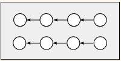

Book Template created by [Charlotte Desvages](https://github.com/chdesvages) and [Pawel Orzechowski](https://github.com/drpawelo). More references below.

## Inserting citations:

[https://quarto.org/docs/authoring/citations.html](Quarto%20documentation%20about%20citations)

# TODO: To be cleaned up - copied from Charlotte's Hello World Repo.

# Display settings toolbar for Quarto

This is a setup for a display settings toolbar in Quarto, accessed via the menu at the top of the right margin. Source code is available [on GitHub](https://github.com/chdesvages/quarto-display-settings), as well as a [demonstration page](https://chdesvages.github.io/quarto-display-settings/).


How it works:

-   `_theme/_accessibility_sidebar.qmd` contains a [raw HTML block](https://quarto.org/docs/authoring/markdown-basics.html#raw-content) to display the sliders and settings.
-   `_theme/accessibility.html` contains the JavaScript to grab the slider values and use them to define the relevant CSS variables, in a `<script>` tag.
-   `_theme/styles.css` sets the relevant CSS properties using these variables.
-   `_theme/atkinson.scss` makes the [Atkinson Hyperlegible](https://www.brailleinstitute.org/freefont/) font available as an option. Credit to [druedin](https://github.com/druedin/atkinson_quarto).

The display settings box is inserted as a `margin-header`, the JavaScript is in `include-before-body`, and the relevant CSS files are included in `_quarto.yml` as follows:

``` yaml
project:
    type: website

format:
    html:
        theme: [cosmo, _theme/atkinson.scss]
        css: _theme/styles.css
        include-before-body:
            file: _theme/accessibility.html
        grid:
          margin-width: 350px

website:
    title: "Display settings toolbar for Quarto"
    margin-header: _theme/_accessibility_sidebar.qmd
```

## Inclusion of math formula
LaTeX $e^{i \pi} = -1$

## Inclusion of table and image

| Index-based implementation             | Matrix-based implementation               |
|:--------------------------------------:|:-----------------------------------------:|
|  <br/> `dqxdx[i][j] = (qx[i][j]-qx[i-1][j])/dx`  |  <br/> `dqxdx[1:][:] = (qx[1:][:]-qx[0:-1][:])/dx` |

## Multiple-row table

| CivEng                       | CompSci                                                  |
|------------------------------|----------------------------------------------------------|
| • Paradigms: imperative, procedural  <br/>   • Object type: concrete, physically meaningful   <br/>  • Action: math and logic operations applied to parameters of the object <br/> |   • Paradigm: object-oriented <br/> • Object type: abstract, blueprint to generate instances <br/> • Action: objects’ methods invoked on instances.         |

## Table and math

| Math  | Code |
|-------|----------------------------------|
| $ C_D = \left[ \frac{0.4}{1 + \ln(z_0 / h)} \right]^2$ | `CD = (0.4/(math.log(h/zo)-1))**2` |

