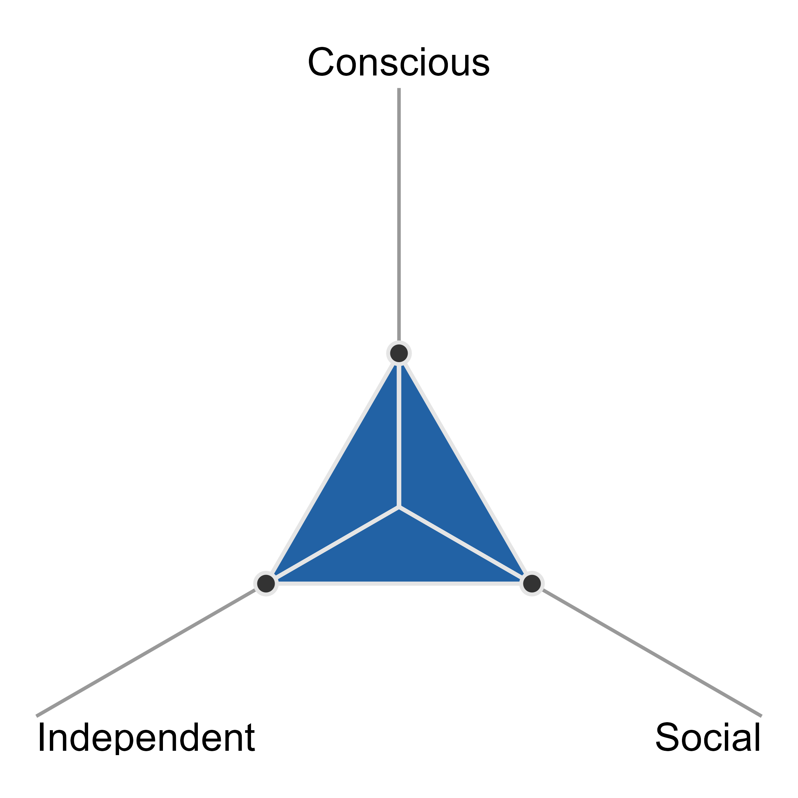

## Introduction

Programming courses often focus on what to write...
syntax, functions, packages, patterns, pipelines.
What gets less attention, even in “intermediate” or “advanced” courses, is how context influences the coding approach and how to dynamically adjust approach to fit the context.
The framework shown in the diagram proposes three overlapping programming tactics, which change in response to the forces at play in a given context - Independent, Conscious, and Social - as a way of making this explicit and teachable.[^C40-radarfootnote]

{#fig-balance width=25%}

[^C40-radarfootnote]: Here we have decided on a radar plot to represent the coding forces.
    It is not absolutely perfect, but this is a limitation we are accepting for now for clarity of communication.
    The radar plot is more accurate than say a Venn Diagram, which problematically implies discrete coding forces.
    A ternary plot we feel would be the most precise, but they can be difficult to interpret so we have spared you this.

The key idea is simple: good programming is not a single fixed standard; regardless of what language you might be programming in.
Instead, different situations call for different combinations of skills, habits, approaches, and considerations.
The classic "well, it depends..." applies to coding as well! This is to say, that in each project or task, the appropriate intensity of each coding force may vary.
