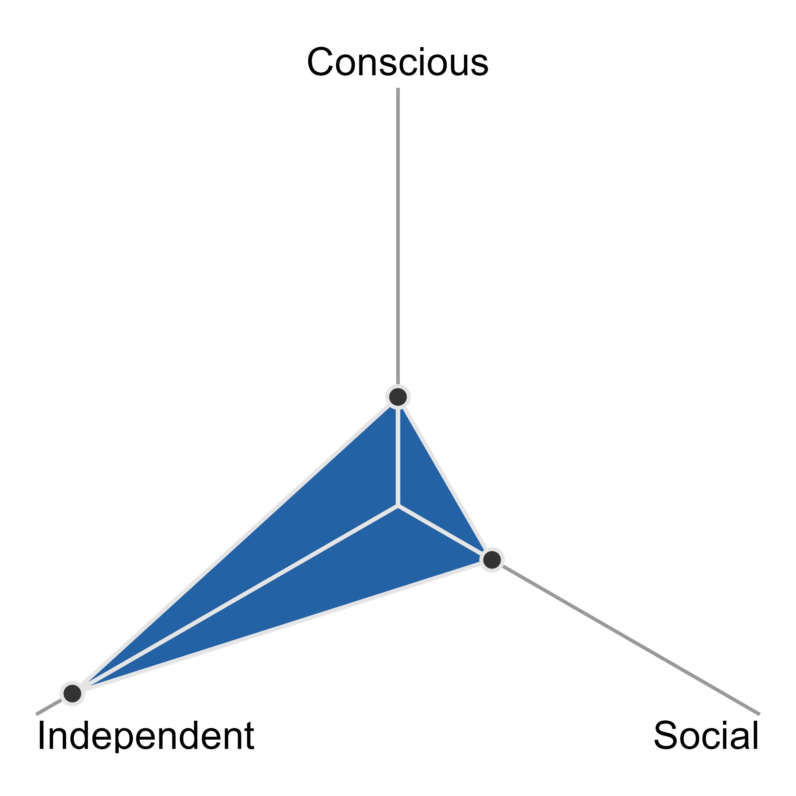
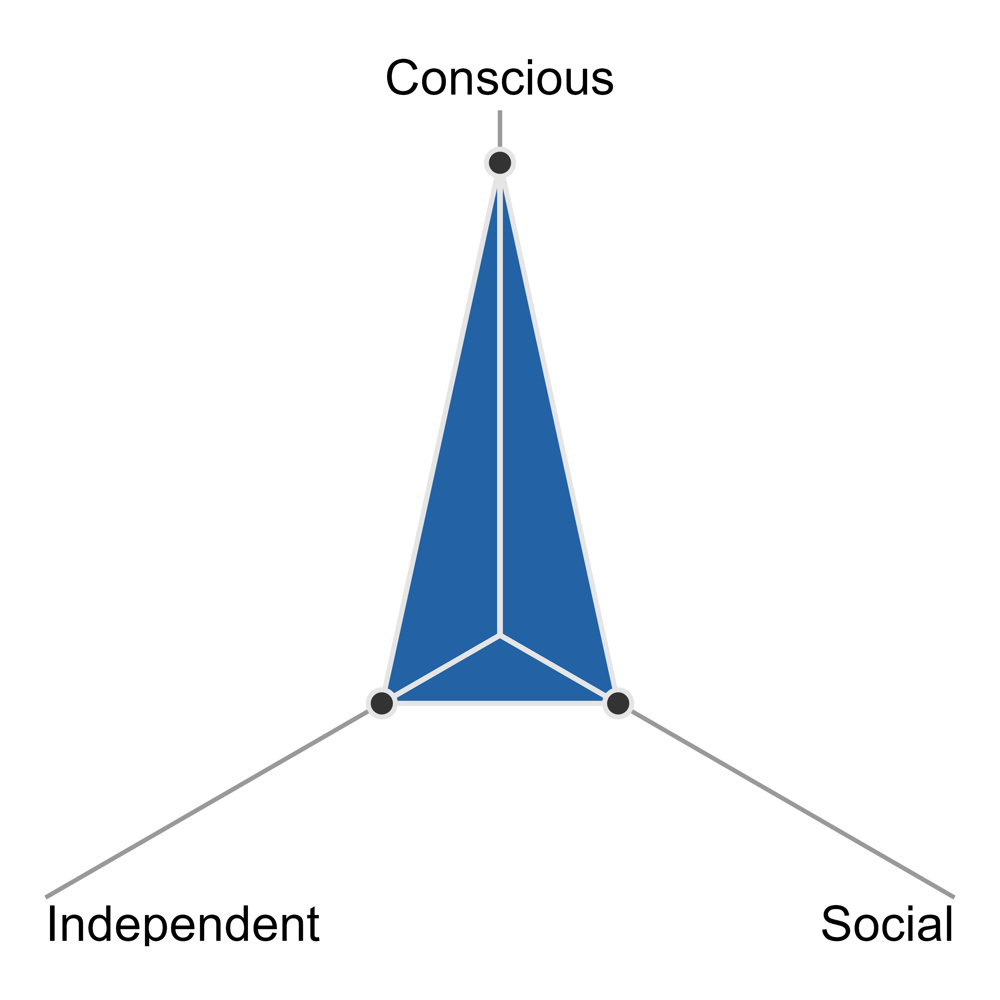
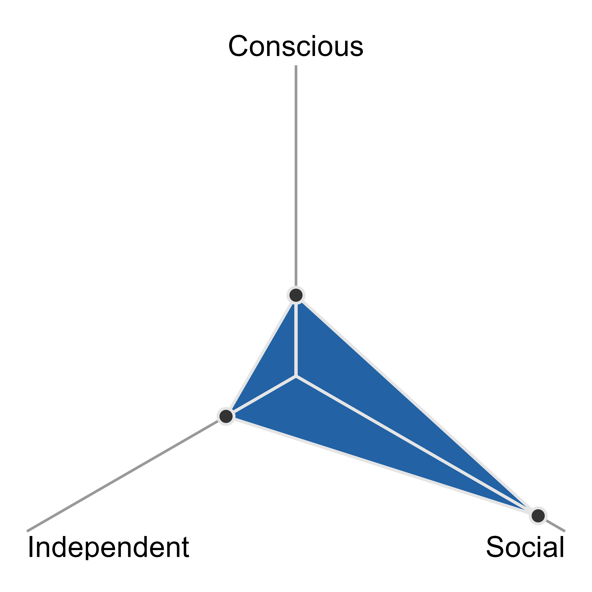

## The 3 coding forces 

Independent coding focuses on problem-solving autonomy and self-sufficiency.
This coding force is all about developing coding approaches without hand holding.
This often presents in debugging, especially knowing when and how to navigate documentation or help files, search web resources (e.g., StackOverflow, books, blogs, etc.) effectively to find workable solutions and crucially adapt them to your context.
Independent coding is about daring to try things out or experiment with ideas, adapt existing approaches, or develop your own new approaches without step-by-step guidance from a blog, colleague, or teacher.
Much of personal learning lives here.
Think "I can do it all by myself and know where to look for help and how to implement it (all by myself) if not".
When primarily leaning into or applying the independent coding force you might produce exploratory scripts, small experiments, and the kind of trial-and-error work that helps to build competence and intuition.
Strong independent coding develops with time and once solid, presents as the confidence to be able to independently learn new packages or workflows.
Independence is what allows programmers to keep moving forward when they encounter unfamiliar problems.
This is often the hallmark of "strong coders".
It is not about knowing everything but having the confidence and skillset to learn and apply (nearly) anything.
Programming skillsets like problem decomposition and debugging come into play here, which are built and strengthened through practice and exposure.

{#fig-independent width=25%}

Asking for help with everything ----------------------------------------- Knowing when, how, and where to ask for help 

Conscious Coding focuses on awareness and intention.
This coding force is all about being mindful and making deliberate (and informed) choices about the structure, workflow, tools you choose to use in your code base.
Conscious coding requires thinking ahead about structure, assumptions, and trade-offs rather than just making code "work".
When coding consciously, you need to consider the bigger picture of how, where your code will be implemented, how it can be maintained, and why you are writing a given bit of code.
With primarily in this force, code comments will document why certain decisions were made (e.g., using one suite of packages over another due to downstream integration, etc.).
 
This is where questions about workflow, reproducibility, and tool choice live-including how and when to use AI.
This coding force is inclusive of thoughtful use of AI or LLMs.
Always bear in mind what it produces, when it is helpful, and when reliance on it may hinder learning, flexibility, or long-term understanding.
This is especially important when you are developing your skills.
One good piece of advice is to type every single line of code AI produces with your own fingertips - avoid the temptation of mindless copy-pasting!
This force is not about speed in making code that "works" or simply executes.
Conscious coding asks you to slow down and reflect:
         - Do I understand what this code is doing?
         - Do I understand how to use this solution in another situation?
         - Is this approach appropriate for this task?
If the answer is no to any of the above, take the time to experiment and learn (moving into the independent coding force) until the answers are yes.
Otherwise, if time does not permit exploratory learning, do not use an approach or solution you do not understand.

{#fig-conscious width=25%}

Blind/mindless copy pasting AI outputs ----------------------------------------- Making decisions based on long term maintenance of the code, only implementing solutions you understand and can debug  

Social Coding focuses on communication.
Code is written to be read by other humans and executed by the machine.
Social coding recognizes that most code is read (by other humans) more often that it is written.
In this way, code itself is a form of communication, which you should want to be as clear as possible.
We do not code in binary (can you imagine how gross this would be) for a reason!
This coding force is all about writing code that other human-beings can read and understand quickly and easily as well as reuse and trust.
This often presents itself in robust documentation and ensuring consistency in procedures and approaches in a given script.
Doing this well means writing code with clarity of meaning - i.e., consistent code style, descriptive naming conventions, and clear documentation though judicious use of comments, and properly documenting your functions.
When coding with a focus on the social force, your code may become longer, taking up more lines - which is not a bad thing! It does not mean your code is not DRY (the principle of Do not Repeat Yourself) but rather balances such principles with readability and communication.
Collaborative projects, research codebases, and (...assessed work in courses...) sit in this space, where maintainability and clarity are as important as correctness.

{#fig-social width=25%}

Ugly rapid code without structure ----------------------------------------- Refactored code with the intention of sharing with collaborators or colleagues who you may not speak to (i.e., needs to be rewritten in a fully self-documenting, approachable way) 

As shown in the [figure name], these coding forces overlap and reinforce each other but are not necessarily at the same intensity at all times.
Different tasks call for different balances and
intensities:
quick exploratory work may mean a priority on independence and experimentation.
Short-lives scripts might justifiably ignore social expectations.
If that exploratory work transitions into being integrated into a proper project with collaborators, the conscious and social forces will be more at play, likely requiring a tidying up and reconsideration of the code.
collaborative projects need more from conscious and social forces
troubleshooting falls at the intersection of conscious and independent coding forces
research and work projects typically sit near the center, requiring independence to solve problems, consciousness to make good design decisions, and social awareness so others can understand, reuse, and replicate the work.

As a tool for reflection - questions to ask yourself in navigating these coding forces
We have intentionally chosen the term "force" to emphasise that these are not discrete modes you switch between, but influences that are always present…and which you have agency over.
Each force can be applied with varying intensity depending on the situation, which is where your agency comes in.
 
This framing makes these forces something you can actively work with.
They become levers you can pull to adjust each force, to manipulate how strongly each one shows up in your code.
In practice, this isn't about turning one force "on" and another "off", but more like pulling levers that allow you to fiddle with the relative intensities of each force.
This leads to a continuous tuning/rebalancing of forces as required by the current context.
 
Of course, those adjustments do not happen in a vacuum.
They are often shaped by "pressures" - internal or external signals such as deadlines, collaborator expectations, or even just that weird feeling that there's something not quite right in your code.
The radar plot reflects this idea.
Rather than separating forces into neat regions (as a Venn diagram might imply for example) it shows them all present at once, just at different intensities.
The resulting shape is simply a snapshot of how things are balanced at a given moment.

[TODO insert gif here??]
 
 
Moving about the spaces these coding forces define requires reflection and awareness.
This can be regularly asking yourself, "What am I doing right now and where do I want to be?".

 
Importantly, it should be understood that using these coding forces is not a matter of switching from one to another.
It's not as if you turn off "social coding" and suddenly become a purely independent coding machine.
You do not take a metaphorical turn off Conscious Drive in order to exclusively be on Independence Avenue.
Rather, you move around these forces dynamically with the intensity of each force adapting to the context or circumstance.
All three forces are always in play, almost more like controls that position your coding brain within a wider mindset space depending on how much each one is pulling at any given moment.
In practice, this feels less like stepping between modes and more like constantly rebalancing, or repositioning.
You might lean heavily on independence when poking at a new problem, then gradually bring
in more conscious structure as you converge to something worth keeping and then
add social clarity as things settle down or need to be shared.

Navigating the coding forces is more like swimming in the ocean or, if you will permit another metaphor, consider each force as a 3D puzzle piece.
As a learner acquiring a new programming language, you can think of your progression through the learning journey and the coding forces as a process of acquiring the puzzle pieces.
As you are learning you may know about these puzzle pieces in that they exist, but knowing about a puzzle piece’s existence is different from knowing what shape it is and how that shape fits into the wider puzzle (the puzzle being the problem in this extended metaphor).
Once the independent, conscious, and social pieces are acquired and their shapes understood, they can fit together like a globe.
If you think of each force as a piece of a globe, when they are brought together a new action is unlocked: spinning the globe and navigating the full 3D space! 
 
[TODO insert image here]
In this metaphor, meta-awareness and reflection is the glue that fits the puzzle pieces together forming the globe and allowing you to take on the hands of God role and move the globe.
This meta-awareness is only possible to reach once you have knowledge of all 3 forces.
It is required to then apply a fitting intensity and direct forces that feels appropriate for the problem at hand.
The radar plot visual also reflects this learning journey - when all forces are aligned, meta-awareness has been reached! Equally, using the radar plot imagery when applied to a specific problem it is unrealistic (and difficult to visualize) maxed out intensity applied to all 3 forces.
However, your knowledge of the force can reach a maximum - this is where meta-awareness comes in to know how to best apply pressure and intensity to each force for the specific problem at hand.
This is to say, critical thinking becomes your meta-awareness.

And once you realise that you are applying your critical thinking skills in the form of meta-awareness of the coding forces, you can measure your own progress and development! 

Speaking of our own tendencies, it is often that we (and possibly also the case for you) naturally fall into fast code that is not social or conscious, which needs to be pushed against.
And this is a necessary step in applying these forces.
Code is never perfect the first time it is written, which is to say, we never get it perfect right out of the gates.
Outputting final "socially acceptable" code is iterative, where each iteration changes the intensity of each force.
When design course content, however, the social coding force strongly dominates in the first instance.

Different pressures tend to nudge the balance of these coding forces in different ways.
A tight deadline might push you toward faster, more independent work (and a temporary easing off of careful structuring).
Struggling to explain your code to someone else is often a sign to increase the social force.
Noticing that you're over engineering might be a cue to ease back on conscious structuring and simplify.
 
The important point is that pressures don't make decisions about how you should be
coding.
They should just be thought of as tapping you on the shoulder.
They highlight when your current mix of forces may be out of sync with the task and suggest that it might be time for a small (or sometimes not so small) rebalance.

Some questions you can ask yourself when navigating and moving between these coding forces are: 

Questions to ask yourself 
Coding force you will be moving into by answering it 
I am stuck, how can I create a mini-reprex for this issue?
Independence 
Will a collaborator (or marker) understand this code? 
Social 
Where or how will this code base be used? Does it need to be over-engineered and consider all edge cases, or no?
Conscious 
Oh, I have a lot of functions, should I maybe separate them out into a separate script and source them in for debugging and maintainability? 
Conscious 

More generally, when building up the awareness of what coding force you are operating in and developing the reflexivity skill, it can be useful to take a step back and reflect on the following: 
What mindset and coding force am I operating in right now?
What mindset should I be in right now?
How do I even know what mindset I am/should be in right now? What is the primary purpose of the task I am working on? 

footnote referencing reprex:  
What is a reprex? It’s a reproducible example, as coined by Romain Francois.
The goal of a reprex is to package your problematic code in such a way that other people can run it and feel your pain.
Then, hopefully, they can provide a solution and put you out of your misery.
The vast majority of the time creating an excellent reprex reveals the source of your problem.
It is amazing how often the process of writing up a self-contained and minimal example allows you to answer your own question.

